# 香港 | 繁华看尽，最美人不知

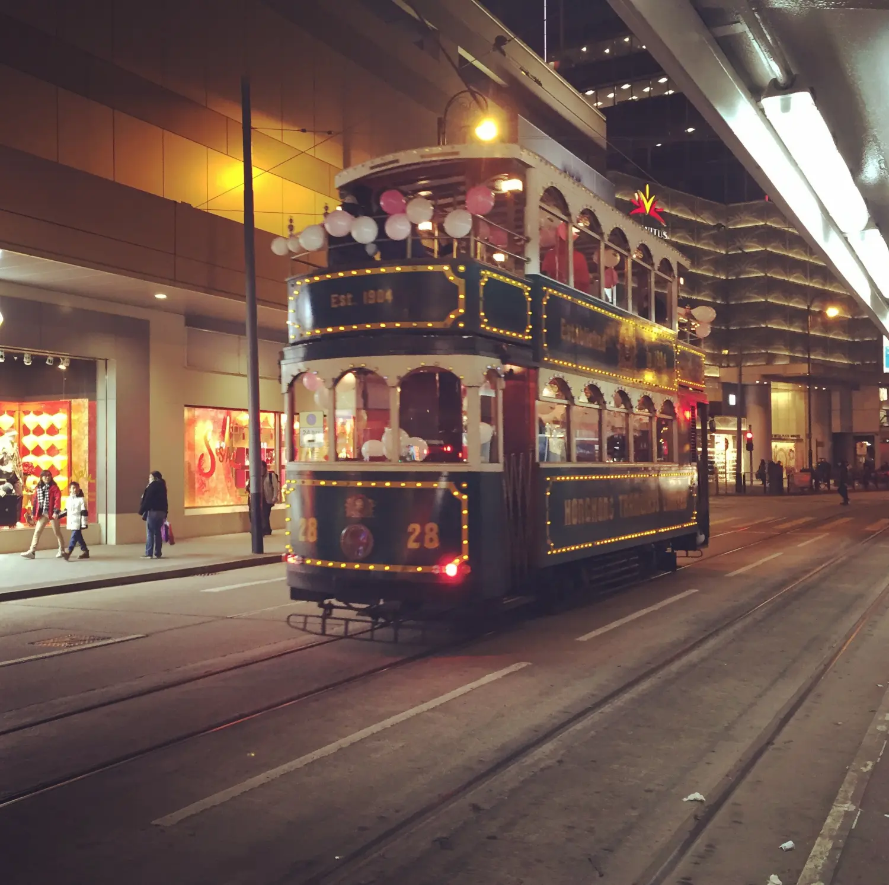

这是年前的最后一次旅行，2月4日，去香港。

据说深圳湾是人流量最少的入境口岸，我心想可能不用等太长时间吧，于是我中午一点左右到达准备过境。太天真了，乌压压人山人海，大概是周日的原因，也不知多少是游客，又有多少是“背货”而去。

看着别人成群结队地手拎大号行李箱，多的两个，顿时感觉陷入代购大军的团体，我只身一人一个小箱子，夹在人群中略显单薄。

身后的几个姑娘一直叽叽喳喳讨论接下来的shopping等，我戴上耳机，默默跟着人群向前挪步。海关麻木地查看每个过客的通行证，人声鼎沸中我终于过境...... 谁知更长的排队是接下来的等大巴。

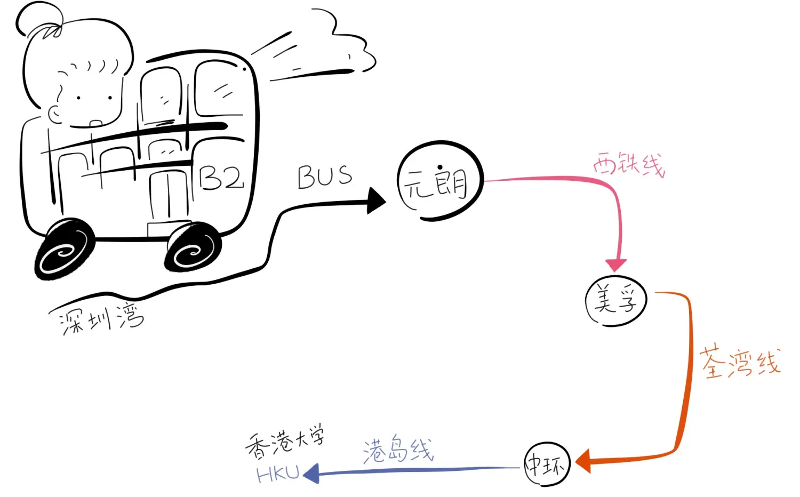

无奈而又翘首期待，终于来了一辆双层巴士，顺利塞下了不少人。凭着记忆我手绘了一份搭乘地图，从深圳湾入境必须先坐接驳的巴士，然后在最近的元朗转乘地铁线进入中环市区。

其实从天水围进入元朗区时，路边的景色就已经开始香港味了，就是那种香港特有的西式与传统的杂合感，比如圣约翰天主教小学之类的，看上去是上世纪英国人残留的文化在香港本土化后的产物，不中不西正是香港。

顺利抵达港大后立刻放下行李继续返回上环附近，和玥玥去看香奈儿在元创方的展 Mademoiselle privé，这让我们的行动多了一些方向感和使命感。好像旅途中若只是买玩买吃总显得肤浅俗套，若是多看看展览和多元文化方面的东西，仿佛立马升华了旅行的意义。记得谁告诉我想了解一个城市最快的方法就是去它的博物馆，所谓文艺，不就是玩乐中还有所得么？

从元创方出来后就在上环附近溜达，找食吃，最大的感觉就是：香港真是一个接纳并融合各类文化的地方啊。街上永远都是游人比当地人多，西方人与亚洲人比例抗衡，新旧文化友好相处，偶尔略不和谐却对比强烈，意外有趣。

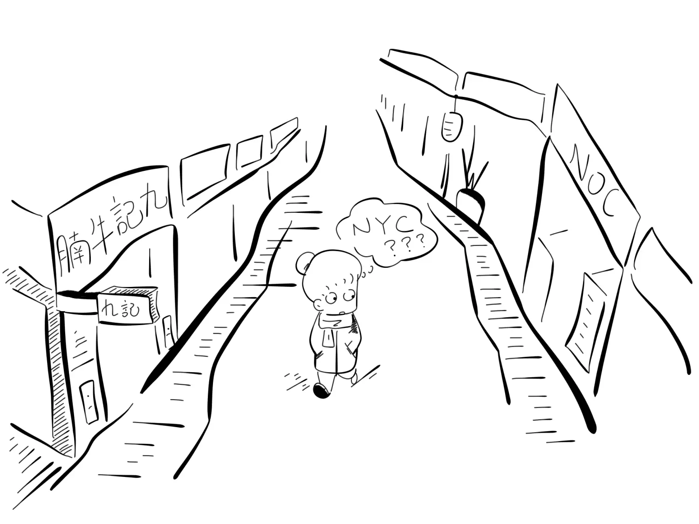

香港多山，地势忽高忽低，徒步疲劳指数绝不亚于旧金山。老旧的街道上我们忽然发现一家十分现代感的咖啡馆，由于字母变形太厉害，我第一眼以为是NYC，是New York City的缩写么？才不是，是NOC，像不像三只咖啡杯的不同摆放造型？店内白灰的主色调极具空间感，咖啡因上瘾者毫不犹豫要进去打卡。

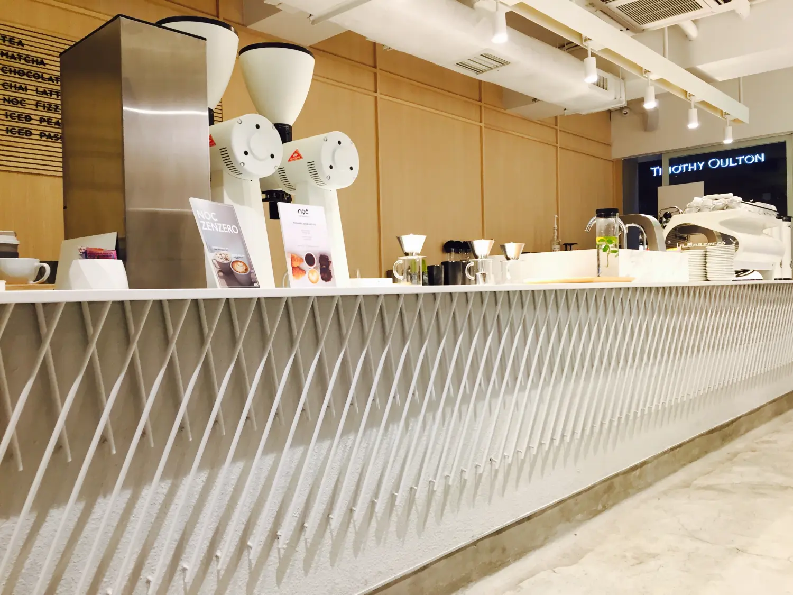

有趣的是，如此现代感爆棚的地方，对面恰是传统接地气老店“九记牛腩”，虽不幸那天周日店家关门，若是营业也必定排队到心焦。

继续一路觅食一路观察，发现在香港除了英伦文化特别受欢迎之外，另一种特受待见的就是日本饮食，从高级料理亭到拉面寿司，各种日本风味在小小的地段上反复出现，莫不是排队等来的饭特别好吃？怎么每一家拉面屋都门外排着站客，我看还是继续寻找当地味道好了。

港式茶餐厅，在我一个外地人心目中，一直是避风塘那样的感脚〜 嗯，好像画风又变了，香港人特别爱用这几个字儿：丽！美！华！翠！然后一路便是这样的排列组合：翠华餐厅，美华餐厅，莲香楼，添好运，不得不说很香港。

在香港吃饭，有点名堂历史的老店都是又破又旧，传承三四代特别老资格的那种，店老板是真的老到脾气臭，只说粤语，不说也不懂汉语的那样。每次进这样的店我都十分犹豫，表达不清怕被骂，骂了不懂那更惨，这是花钱找骂来了吗？

大陆游客多有这种被怼的经历，可是一波波前来打卡的单纯而可爱的人儿们依旧络绎不绝，久而久之便形成这样的现象：百年老店小破脏乱，不刷卡更别提支付宝八达通，自备现金不收大额纸钞，拼桌是常态，被挤，被挤，被挤，被撞，没有服务可言，反正爱吃不吃门外还排一大串。

但，游客偏偏很好这一口啊〜 入乡随俗，我们顺利进入“沾仔记”，一个单靠招牌云吞面而及受追捧的米其林平民美食！

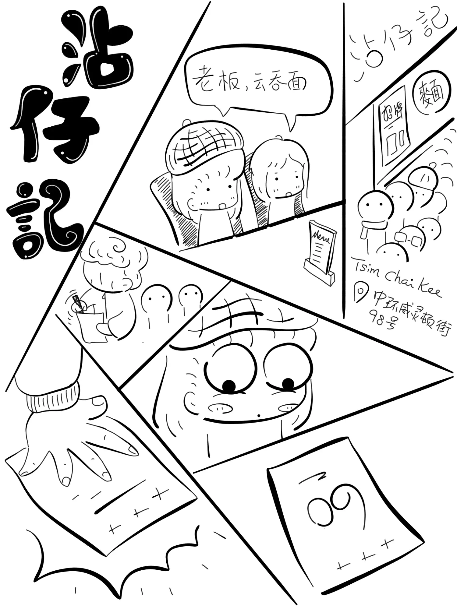

“老板，云吞面。”

老人家飞速在便签上一划，一张奇怪的单子被放在桌上，没有菜名没有编号，上面只有一个60。

好吧，一碗面30，那就是你的价钱，吃完凭此结账，好像这就是店员与收银专享的暗号一样，别多问就这价，在翻桌率超高的小餐厅这招特别高效率。

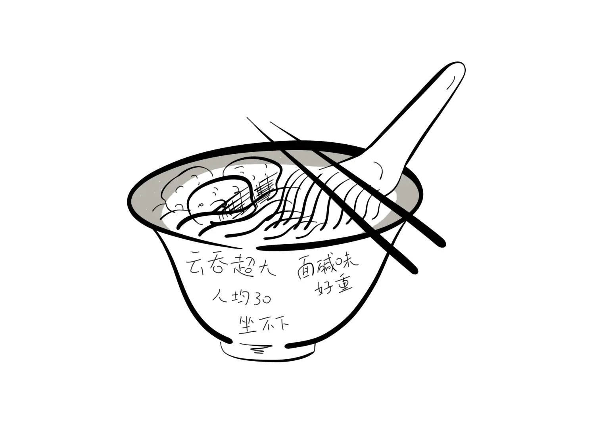

7号的早晨，我无意间在Youtube上看到《一城一味》的香港那一期，节目里走街串巷了好几家人气爆表的香港老店，什么蛇王芬的蛇羹，添好运点心的菠萝包，还有什么烧腊，都没太大兴趣，然后，兰芳园的丝袜奶茶，好了，果断决定说走就走。

中环地铁D2出口，直觉告诉我就在附近，却愣是被高德地图误导了半小时！从此我发现高德出了国就定位不准，火速换成谷歌地图才发现自己真的是兜了一圈，路痴到看不见犄角旮旯的店。这绝对是最接地气的网红店，不能再简朴的店面已被围得水泄不通，排队的人马也已站到对街。

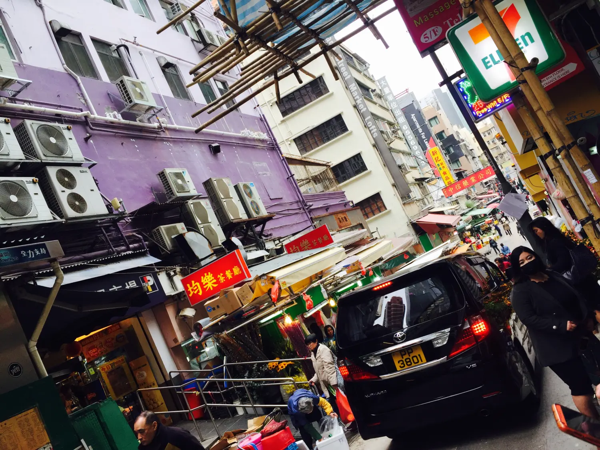

旁边一个流动板房一样的铺子就是专门制作奶茶的地方，我只能看见窄小的窗口里一个人的手臂在不停地来回过滤着红茶，那形状谜一般的滤袋想必就是“丝袜”的名之由来吧。

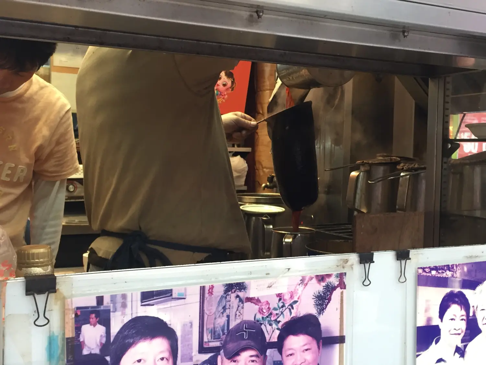

坐是别指望了，进都进不去，买了带走吧。店面前立着一个小柜台，一位中年老妈子负责招待客人，场面一片混乱，我真不知该怎么插嘴，于是观察人类的癖好又犯了，先看别人的操作吧。

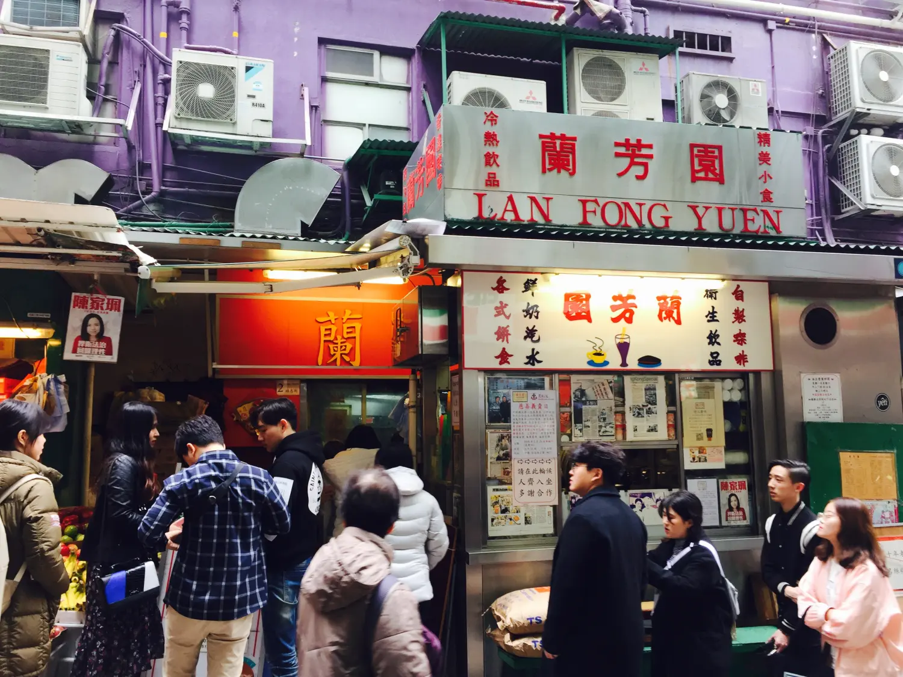

游客大多迟疑不决又一知半解，看着菜单又问东问西，粤语不通之下沟通也不畅快，里面催促茶好了快送出去，外面又咋呼怎么没有糖包，老妈子火气上来了，唉此情此景也算意料之中。

想到自己买串鱼蛋也被怼，这次绝不再吃粤语不通的亏，我迅速瞄了一眼菜单，直接准备好20元零钱免找零，力求最大化减少沟通的麻烦。

“小妹你要什么？”

“丝袜奶茶，热，带走。” 同时我把20元塞到她手上，就在我为自己行云流水般的操作自豪时。

老妈子来了一句：“Wait outside.”

哈！？这姑奶奶了得，原来会英语！我服，乖乖得站在一旁等着，继续看她叱咤风云般的现场指挥， “You in, you wait outside.” 这个用来怼外国人大概也管用，远远那么看着，搭配那个招牌背景怎么那么莫名戳中笑点呢。

它的纸杯复古得像是从港剧老电影里走出来的，好喝吗？只有自己喝过才知道吧，由于它的茶味很重倒是很符合我的口味。再后来，我居然在Vingo看见了便利装！这架势就跟星巴克进超市一样，注意，喝多了会失眠。

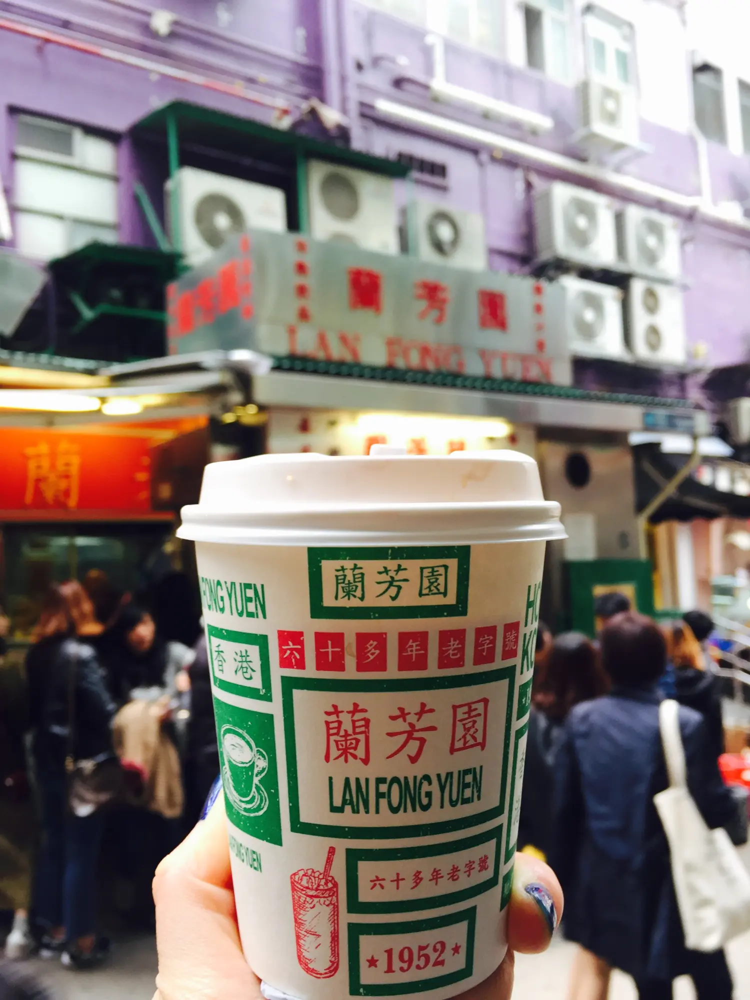

在香港，怎能少了买买买，于是接下来的主要精力都放在港岛区的上环，中环，铜锣湾，尖沙咀这几个最繁华也是人最多的宝地。进了尖沙咀的海港城结果一天也没逛出尽头，也不记得我到底从哪个入口进的，出来时发现天都黑了，而且已经莫名置身在维多利亚港的岸边，好像并没意识到走了一天都在建筑群里。

夜晚看着维多利亚港口，我竟产生了这是外滩的错觉！一定是购物导致的头脑不清晰，我向岸边继续走近，迎面冷风一吹，还夹杂着水味，特别臭，清醒了。但我依旧觉得霓虹灯下的大都市，若不凭借地标辨认，还真是好像。夜晚七八点的香港，上海，纽约，芝加哥怎么有种莫名神似，熟悉感中寻找不同，因为中银大厦，东方明珠，布鲁克林大桥，Trump大楼，都市的天际线才不同。

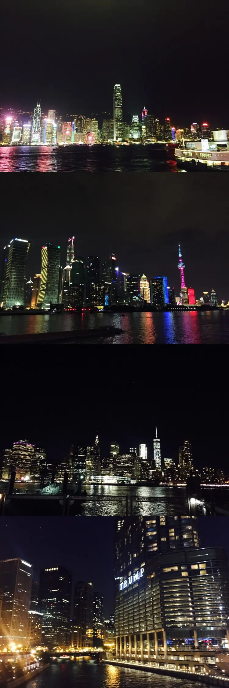

（自上而下分别是香港维多利亚，上海外滩，纽约曼哈顿，芝加哥。）

差点忘了说我们爬山的壮举，从港大纯体力爬到太平山顶，太酸爽！又兴冲冲上了凌霄阁，就差临门一脚拍张美美的，谁知是大雾天。

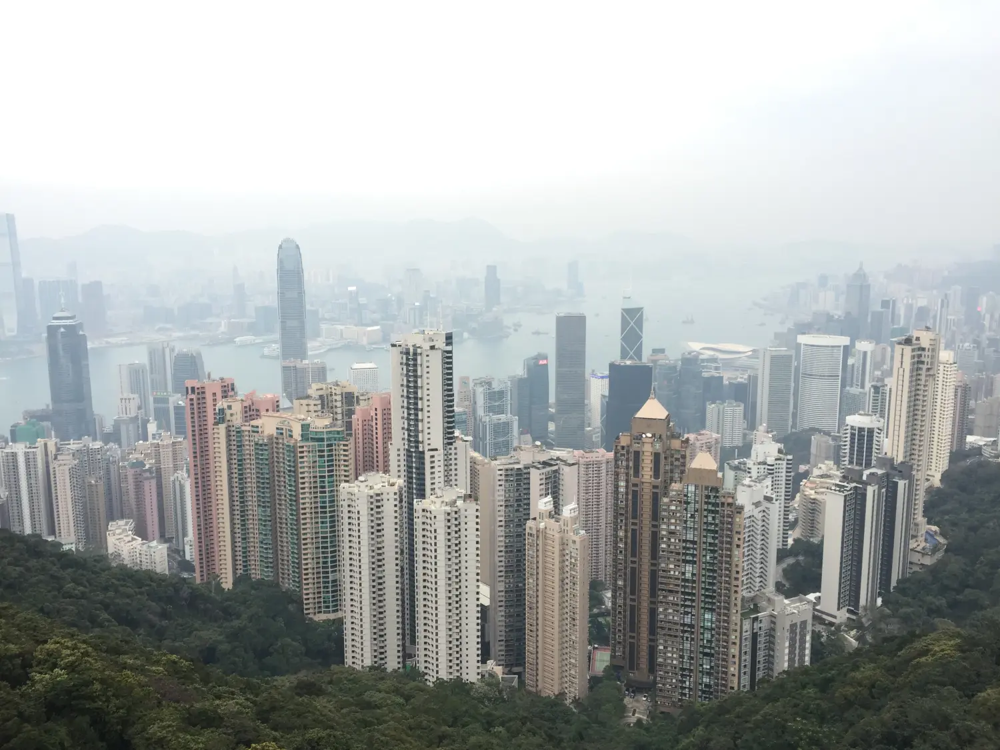

其实香港对于我最大的吸引力并不在于繁华的金融商圈，而是一些悬于边界上的文化和风景。

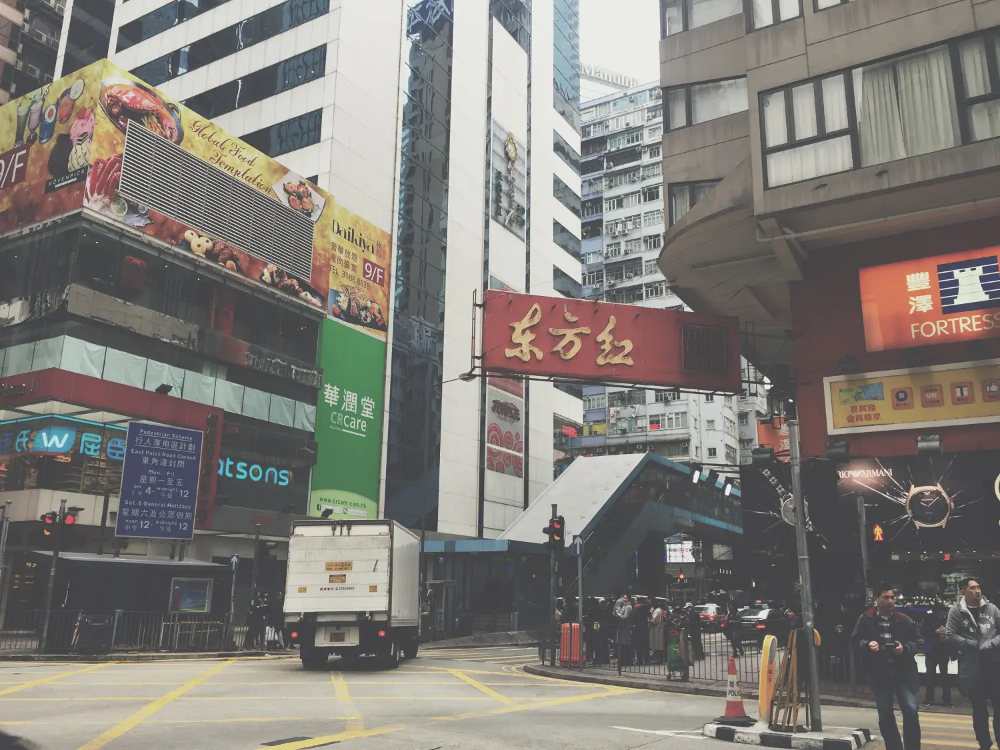

那些不太容易入眼的东西，或像骑楼之类特别古旧的事物，就那么宠辱不惊地穿插于最繁华忙碌的地段，它们才是香港最本土最本真的内涵。

而不管外来人口和西洋文化怎么渗入，惜时如金的白领精英怎么脚步不停，楼下车水马龙怎么穿梭不息，楼上依旧床单内衣飘摇，“老香港” 用它特有的姿态不屑于这个时代的潮流冲击。

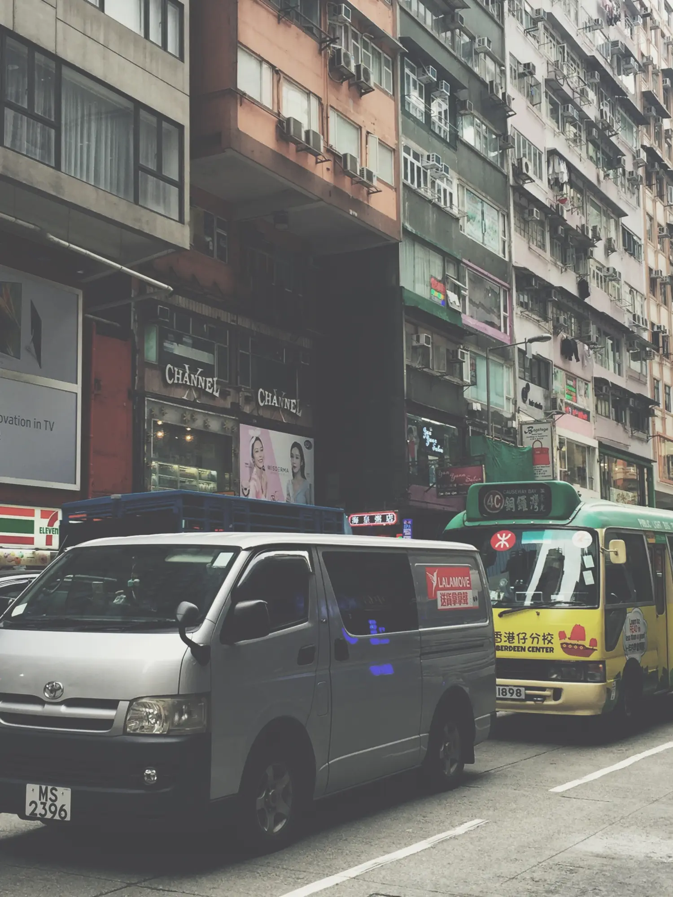

眼前的景象常突变得令我措手不及。这里土洋结合，现代化飞速向前的同时，传统也从未消失。

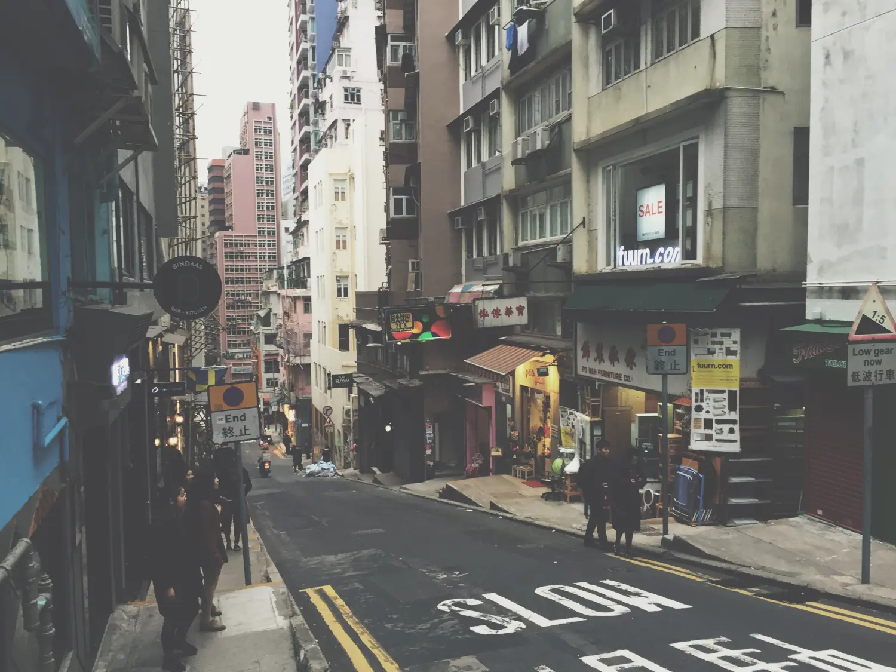

但不知道这样的景色，还能拥有多久，以后又会在哪一天销声匿迹了。

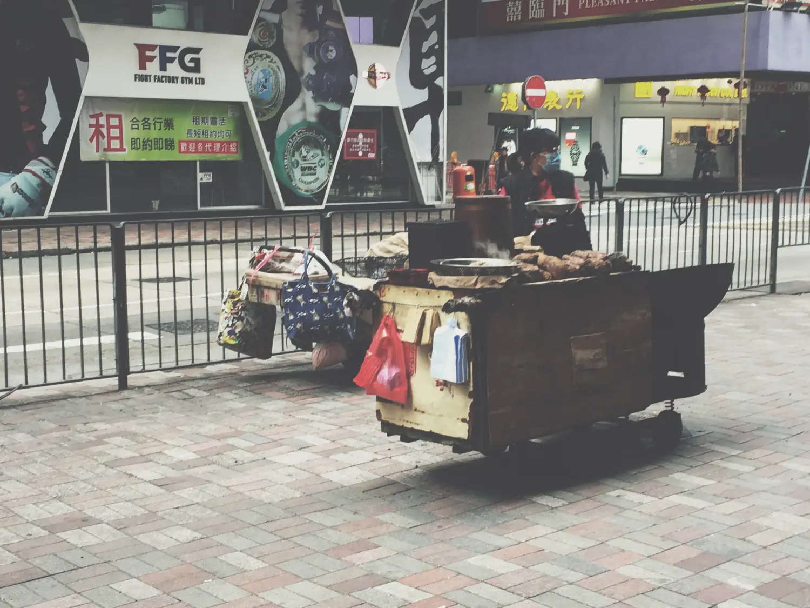

最后，总听各种关于香港住宿问题的吐槽，小还贵。我幸运地蹭住在港大宿舍里，早出晚归跟港大的门卫大爷混出了脸熟，既然如此就不吐槽香港人均居住面积之小了。总之，折回深圳到家第一件事就是：放下行李，伸懒腰！

