# 京都 | 去京都漫步，住胶囊吃泡饭

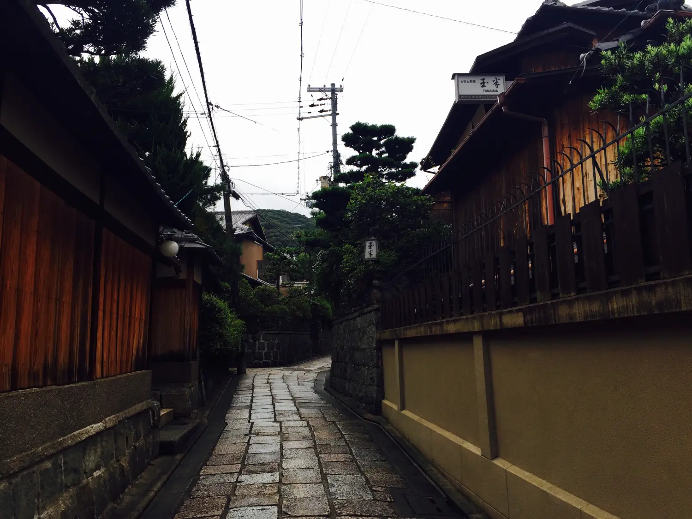

京都，是典型的「古い町」。徘徊于一屋一瓦之间总禁不住让人联想下一个转角会不会走出一个艺妓。现在应该不太可能会有了，那些在「花見小路」上的惊鸿一瞥，可能都是游客们在cosplay。

从花見小路到「二年坂」「三年坂」直到「清水寺」，是最具京都风味的游客打卡集中地。这里确实有很美的古风，但要来的早，只有早晨七点左右空旷的石板路才好看，再晚两个小时可能就要挤成南锣鼓巷了。

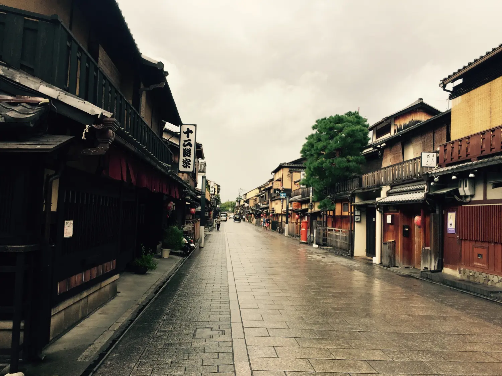

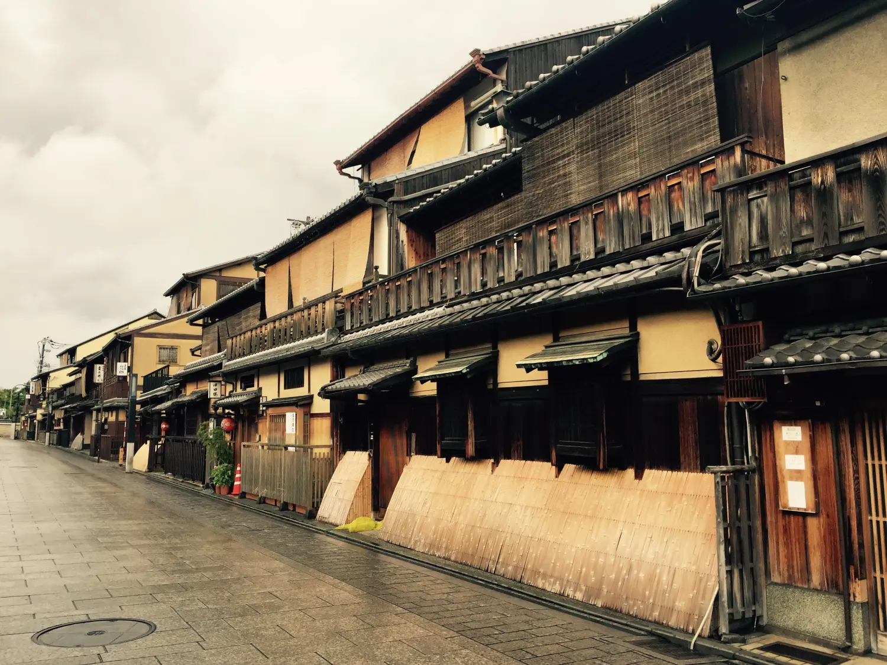

不知道你有没有这样的感觉，在一片古朴之中，如果突然有一个现代感的元素闯入，会产生一种诱人的反差感促使人一探究竟，比如开在「二年坂」的星巴克。这里，标志性的黑白绿变成了原木色；这里，沙发座椅换成了榻榻米；这里，人们盘腿端坐在矮桌边喝咖啡；然而，不管噱头打得多足，也改变不了星巴克难喝的事实。

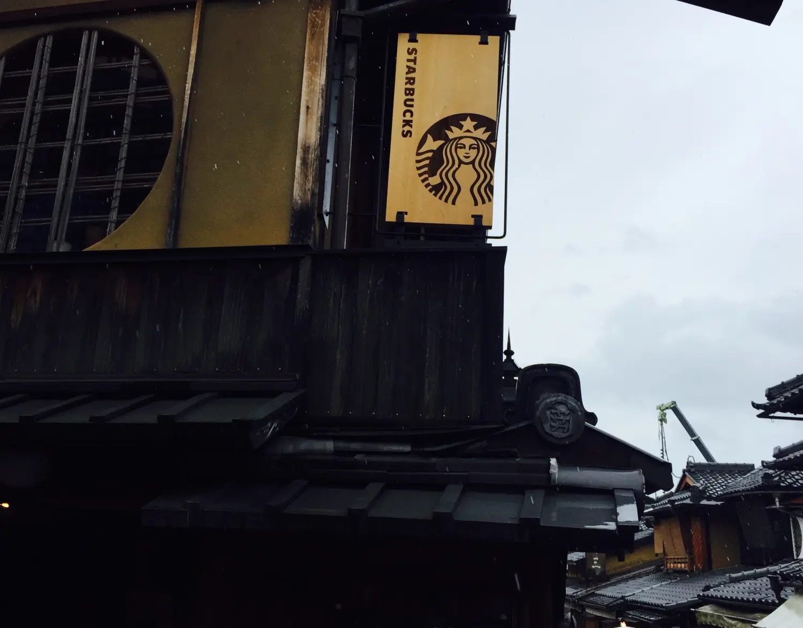

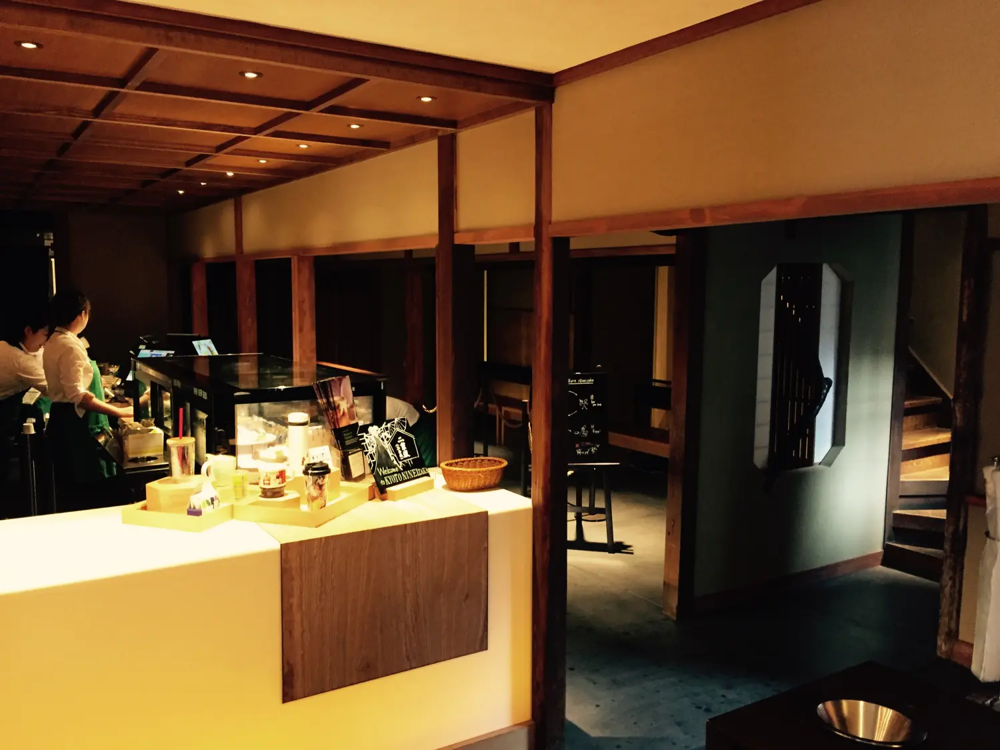

人们喜欢从各个角度去比较東京和京都，不仅是游客，日本人自己也习惯性地东西两方互怼，类似于国人今天的北京上海针锋相对，你是喜欢京味还是海派？打个比方，如果東京的人设是初音未来，京都就是大和抚子。東京什么都有，有时节奏快到来不及消化，在地铁站，如果我走路太慢就会觉得很对不起大家，而这也是我喜欢京都的一个重要原因：我永远都不会看见那些穿戴整齐划一，手拎公文包的東京上班族，神情严肃而又健步如飞，如同僵尸过街般的浩浩荡荡。

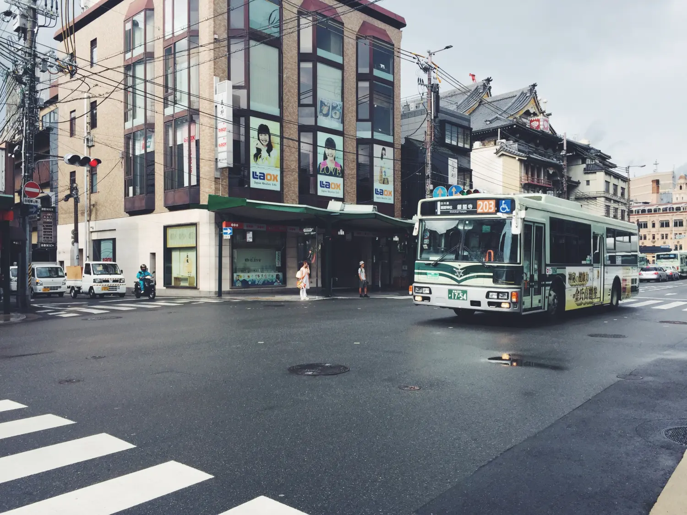

说到国际范，東京一定比京都前沿很多，但其实京都更吸引西方游客，我一路就看到很多欧美的背包客。京都有一个地方很“国际范”，它汇聚了世界各地的游客，囊括各种国籍，但它不是 Bar，而是Capsule Hotel，就是在日本创始的胶囊旅馆。说来这也是意外的发现，日本住宿是出了名的贵，要在京都大阪逗留几天的我们必须选择胶囊旅馆，好好地省了一把银子。当然，聪明的背包客都选择了这样的方法，或者说如此独特的住宿体验反而更吸引外国人。

在胶囊旅馆，除了一个床铺大小的长方体空间是属于个人的，住宿区会分男女或家庭胶囊，其他一切设施和场所都是公用的。早晨，不同肤色的人纷纷爬出胶囊，蓬头垢面，睡眼惺忪地互相问好 'Hey.' 'Hello.' こんにちは〜，然后在洗漱区相遇，刷牙洗脸，化妆吹头发，即便是语言不通的人也能自然融入，管理好自己就行。

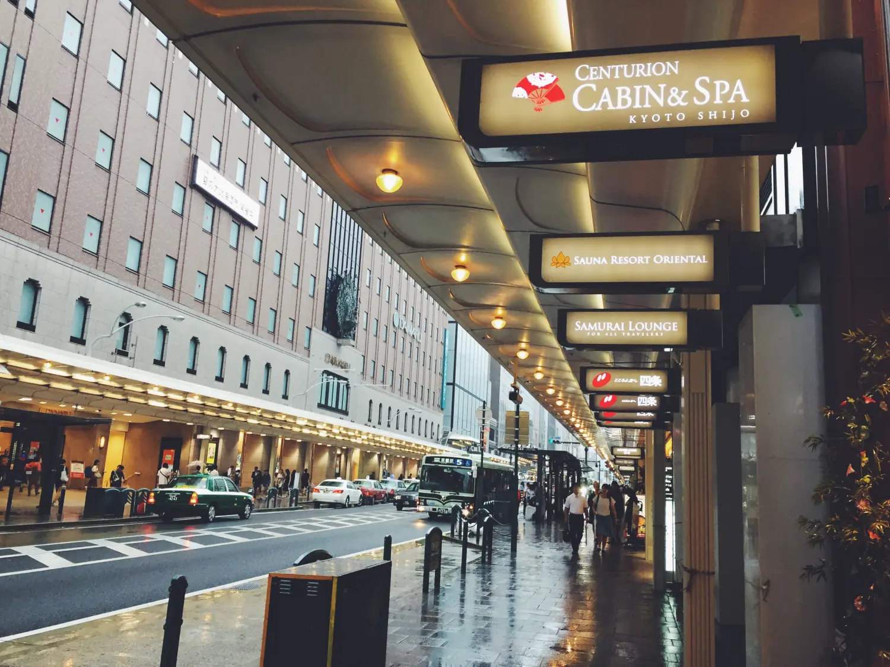

一切都可以公用，唯有洗澡这回事儿是西方人不能理解的。胶囊旅馆肯定是采用公共沐浴的，我们在「四条」选了 Centurion Cabin&Spa 的胶囊旅馆，还是带室内温泉的那种，已经再好不过了。西方文化中有很强的自我隐私性，从更衣到沐浴都是有自己的空间的，绝不会出现另外一个光着身子的人站在旁边。当亚洲姑娘们在更衣室一边谈笑风生一边爽快利索地脱衣服准备去洗澡时，进来的每一个西方人不管是年轻女孩还是中年妇女都是目瞪口呆。

为什么呢，亚洲是典型的集体主义社会，催生出公共澡堂的文化并不奇怪；而西方从来都是个人主义，不干涉别人也不愿被侵犯，虽然都是女人嘛，但面对别人的裸体时，我还是看出了她们呆若木鸡的神情下浅浅的羞涩，不好意思暴露自己的同时也害羞看见别人。

这些不自然的尴尬和羞涩都是瞬间产生并立刻消失的，毕竟这里就是亚洲，在别人的领地上谁也不愿意被当成另类。欧美人大都没搞清楚状况，低着头自个儿脱衣服，几个大大咧咧的美国姑娘问 What should I do？意思是到底要咋整？我们说衣服脱了放进自己的Locker就可以直接进去洗澡了。印象中特别深的是一个中年的欧洲女人在一旁，衣服脱到一半还是觉得很变扭，回头问：'Can you tell me how does it work?'

对这句话我记得很清楚，因为这个措辞太不寻常了，不仅仅在问：我该怎么做？还在质疑：这到底是个什么流程？拿着衣服迷惑地看着储物柜的她不敢相信，一进来就在这里脱完么？我好像说了 take it all，just be naked 之类的直接暗示，但是话糙理不糙，我想告诉她：对滴，你要在这里脱光光哟～

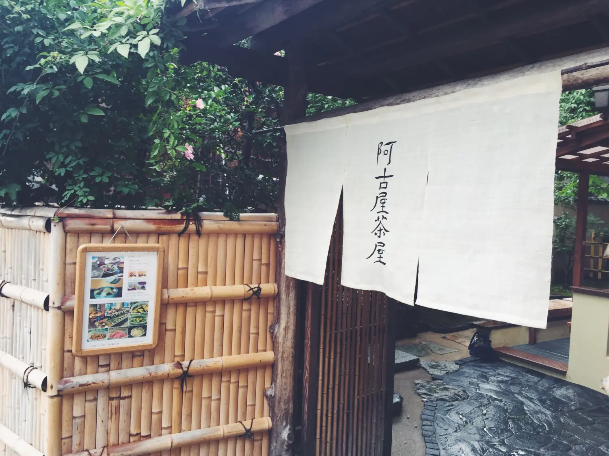

不能免俗地，我们还是要谈谈吃。在京都，还是先不要考虑拉面咖喱炸猪排等普通的日料了，去吃茶泡饭吧。「お茶漬け」茶泡饭本是平民料理，却在京都的烘托下被提升得逼格满满，就好比懂营销的素食馆反而可以经营地更显高级。

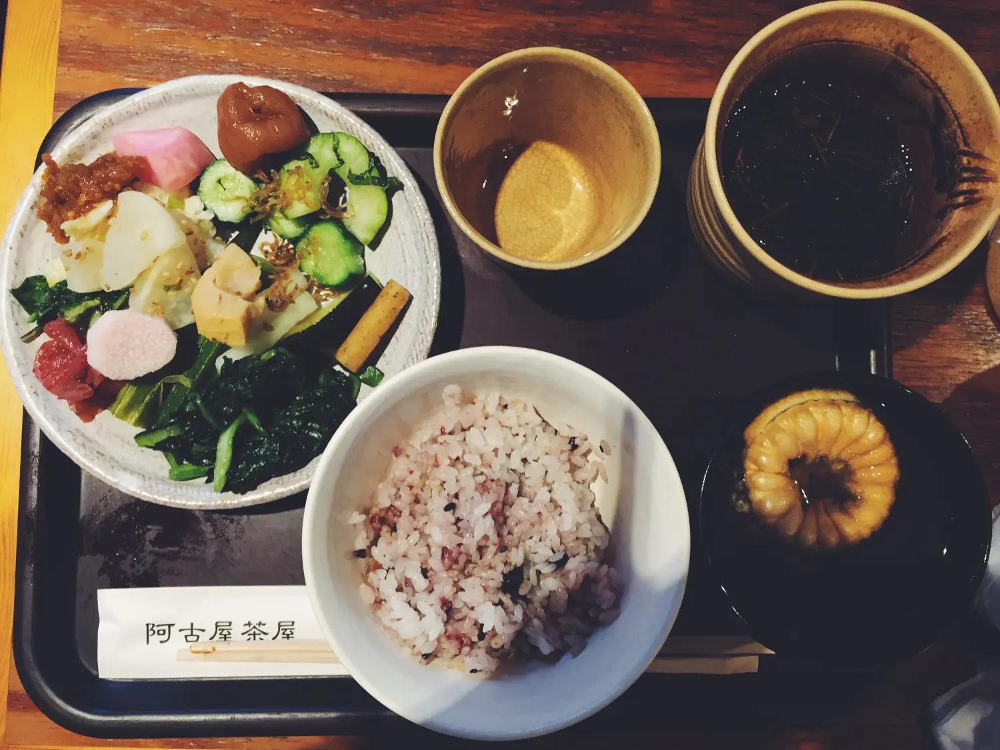

茶泡饭简单，精髓却在茶，热茶先泡一分钟，再慢慢浇在米饭上。每次米饭最好七分满，这样可以吃两遍，一次煎茶，一次青茶。東京人喜欢加上天妇罗、金枪鱼或鲑鱼等豪华的食材，还记得《深夜食堂》里的茶泡饭三姐妹吗？“老板〜乌梅，鲑鱼，鳕鱼子。” 往往亲切而温柔的轻食最能温暖疲劳的胃。

在京都，不怎么用荤的，用的只是渍物。「三年坂」的阿古屋是自助餐感觉的茶漬屋，只要你吃得下，可以一碗一碗地盛饭，千奇百怪的酱菜泡菜咸菜也是任意搭配。

京都人好像特别喜欢腌渍过的食物，什么食材都可以拿来渍一渍，萝卜牛蒡渍一渍，山药黄瓜渍一渍，樱花也要渍一渍。祇園附近开着好多家“京渍物”的老铺，每路过一家我们都要闯进去试吃几口，一路下来嘴巴都尝咸了。 要不是味儿略大，飞机不让带，我可能会背回来一罐咸菜。

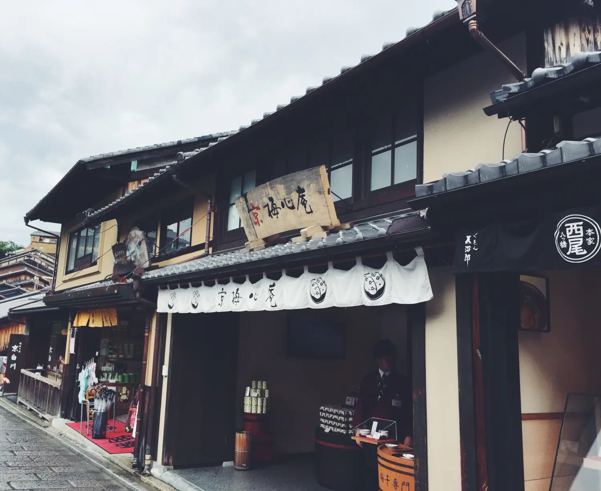

渍物吃咸了，自然就想找甜食。在京都，「もち」和「団子」都格外常见，都是些变着花样的糯米团子类食物，我明显感觉出自己碳水化合物的摄入量比在东京高了很多。

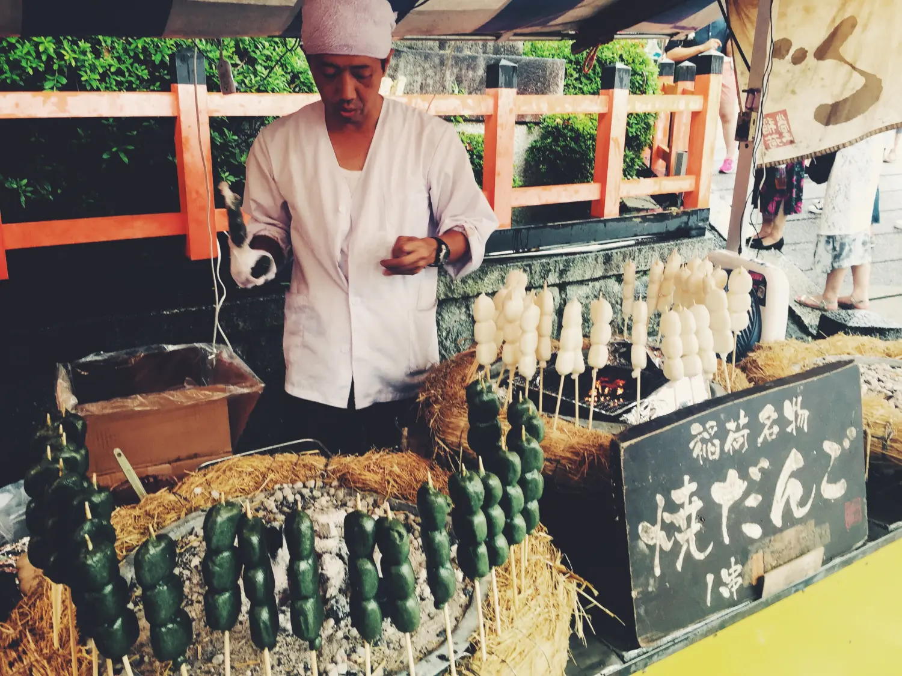

除了吃，京都值得去的地方也是多得要列清单。攻略榜首常有：清水寺，金阁寺，二条城，伏见稻荷，八坂神社，祇園，先斗町，鸭川，就不写了，马蜂窝一定比我写得好〜 不如说一个渡月桥。

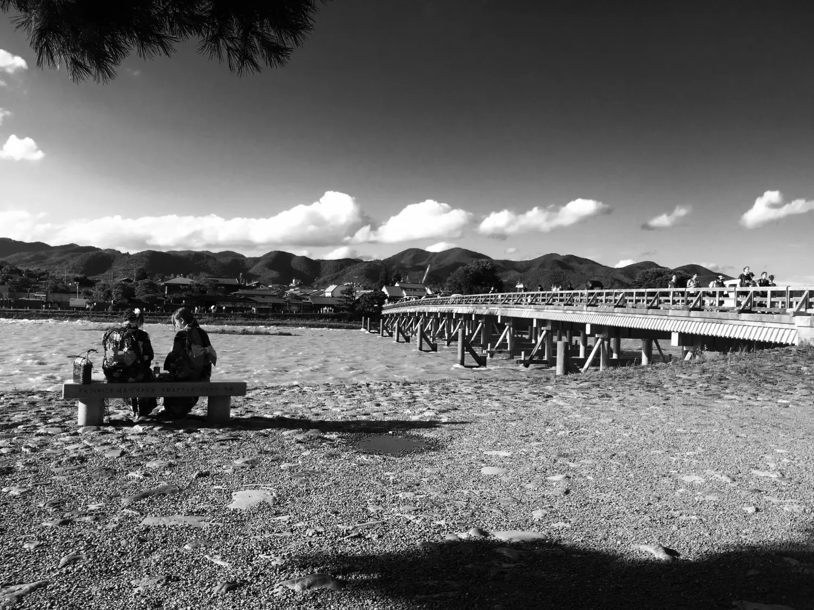

渡月桥本身就是一个没什么特点的木结构桥，我只是单纯的喜欢这个名字，而且还是看柯南看出来的，最新的剧场版不是《唐红的恋歌》么，片尾曲就是仓木麻衣的渡月桥呢。看过剧场版的话，就一定知道渡月桥是观赏红叶的绝佳之地，秋天的话一定很美，可能还会大塞车吧。

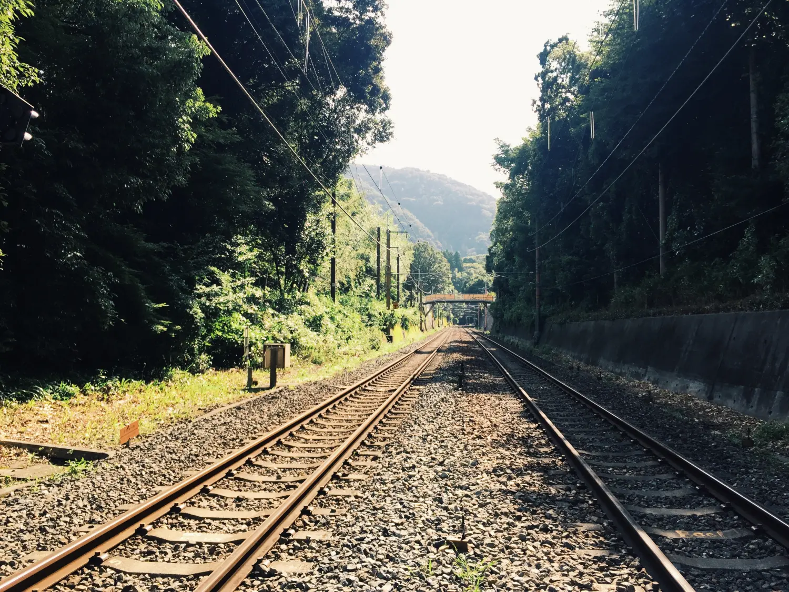

渡月桥属于岚山，左边就是嵯峨野，拍《卧虎藏龙》的地方。岚山虽远，离京都市内有点距离，却是一个值得消耗一天的地方。可以坐坐嵯峨野小火车(トロッコ列車)，可以坐下吃和菓子，可以逛逛可爱的杂货店。

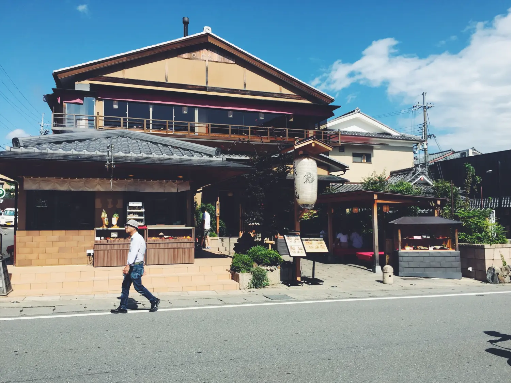

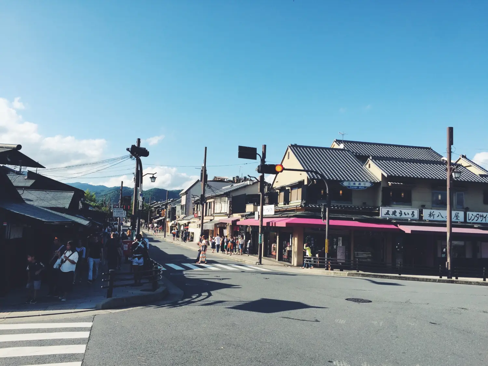

最后，我要安利一个买手办的好店「よーじや」或者YOJIYA。这个名字对于很多人来说还很陌生，但在日本本土却是个极具沉淀，无人不知的品牌，尤其对于其发源地京都更是宝物般的存在。

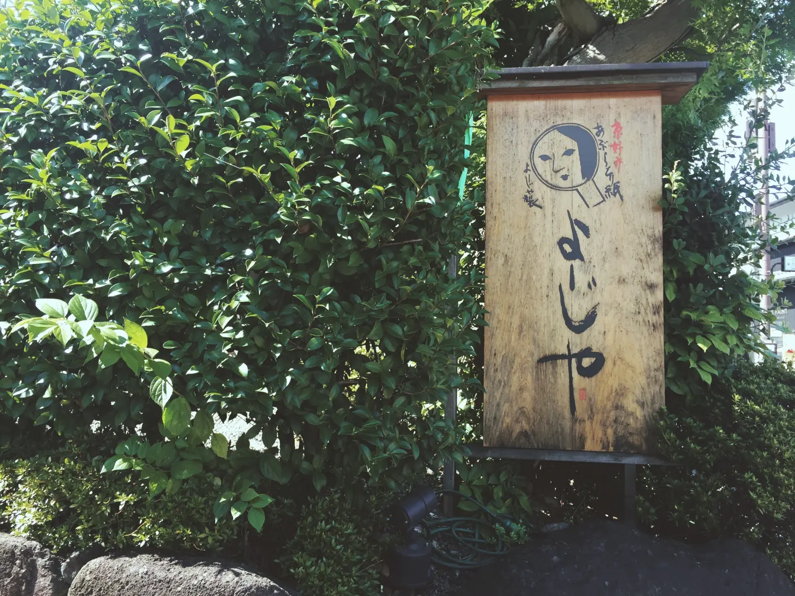

因为它只限于京都，地域限制性就是YOJIYA最大的特色了，在祇園、清水、嵐山等都可以找到。所以，这份礼物足以代表京都的风情，关键，它只是Muji的价格，却更有你想要的个性。

京都既然是艺妓文化浓郁的地方，YOJIYA可想而知是一个因艺妓而产生的化妆品牌。其中以「あぶらとり紙」（吸油面纸）最为出名，含有金箔成分的吸油面纸，因能使艺人的妆容清爽持久而大受好评。改良后的产品像小册子一样便于携带，价格美丽（却是实在的吸油纸中的爱马仕哈）。各种油纸的季节限定品「桜花」「柚子」「芦荟」更是备受女性青睐。YOJIYA的柚子护唇膏，迷你花镜，香粉盒也是既实用又可爱的小礼物。

个别YOJIYA还有小咖啡店可以休憩，如果刚好在嵐山、银阁寺或祇園附近，不如进去稍作休息，“艺妓脸”的抹茶拿铁是很有特色的哟。

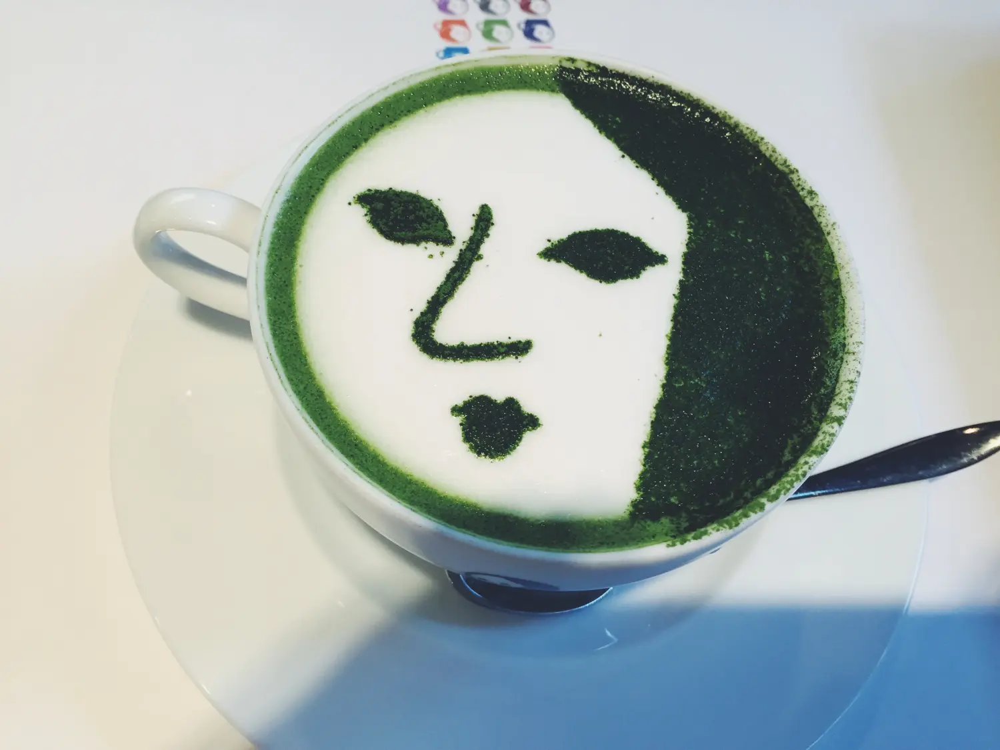

好了，最后摆两张千本鸟居，散场〜

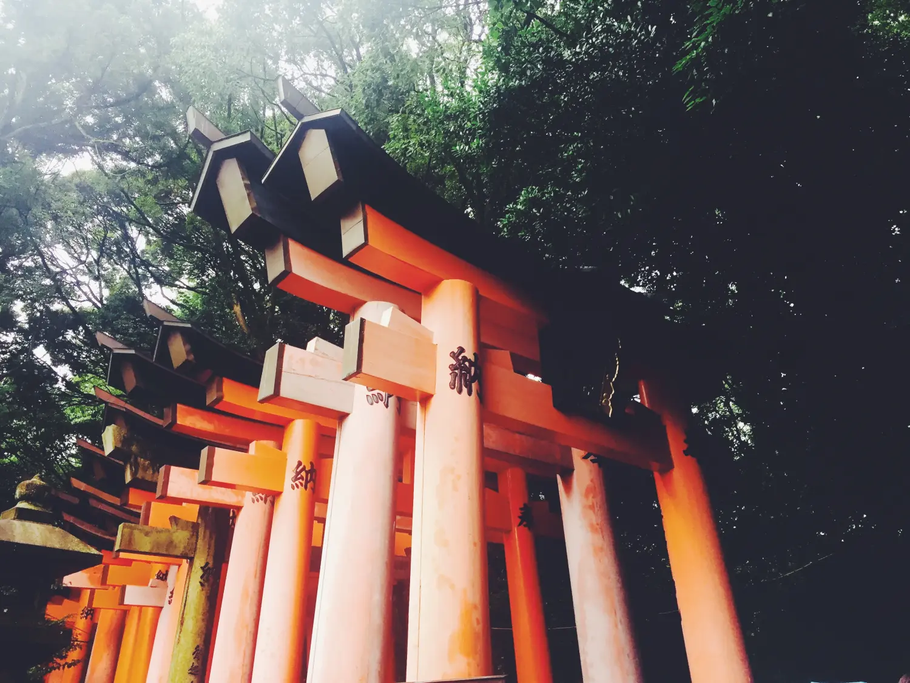

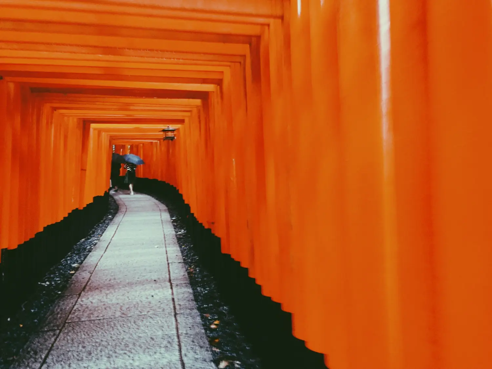