# 一城一味，一期一会

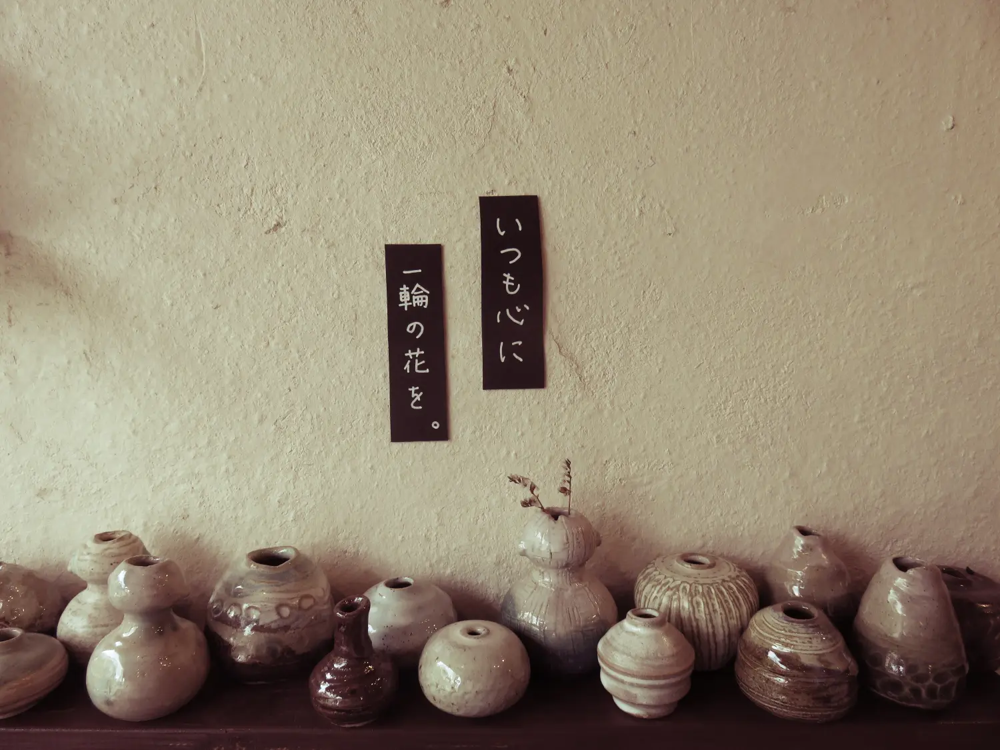

这次去冲绳，实在是个意料之外的事件。

本来打算约去香港，于是我们选好了日期，看中了机票，物色了酒店，扒好了攻略…就在订机票的千钧一发时刻，手机屏幕上的一条新信息却把我吓得魂飞魄散。

“我买不了机票啊，我护照过期了天呐！”

我两眼一黑。姐啊，你这是有多久没出远门了，护照过期一个月居然不自知？！

我向来对雷厉风行的快手十分满意，但这次我真庆幸慢了一拍。且不说计划泡汤，这种无语的理由按常理我大概要拍桌拍大腿了。立马转移注意力，快想方案B，问题解决高于一切责难是非。

于是我在成田机场和浦东机场之间划了条线，往南飞的航班耗时差不多，一直一直往南看，瞄中了冲绳。因为这个没有护照就出不了国的人，事态突变之下就变成我出了，谁让她是我姐呢，是我最爱的一只呢。

M比我大两岁，M她娘说好像多了个小女儿，所以我总是叫她「お姉ちゃん」（M小姐姐）。没有血缘的关系，只有时间的沉淀，也真不知是什么宇宙间的吸引力法则可以这样形成牵绊，想想有时后天亲人大概就是如此吧。

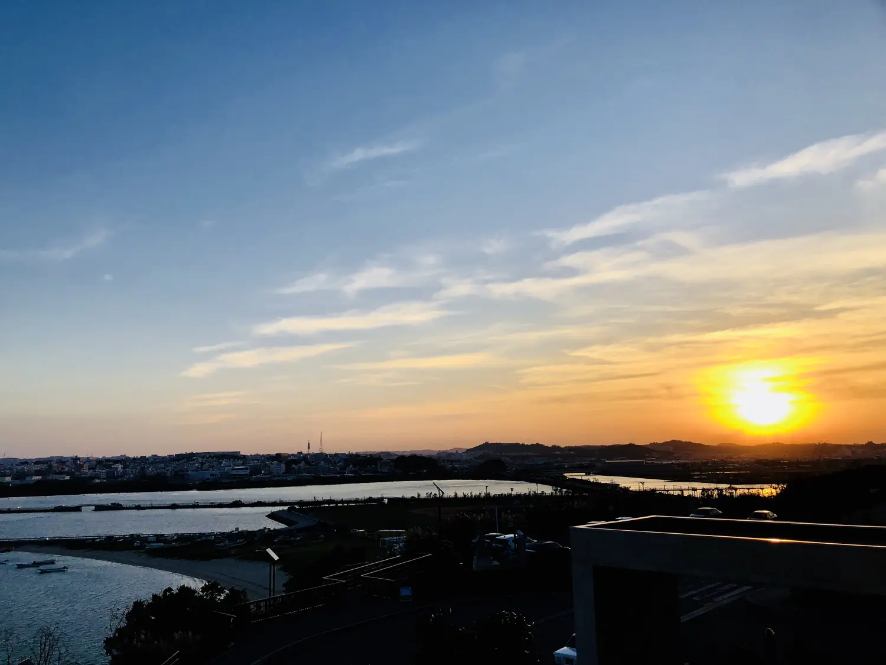

记忆离不开地点的依托，而记住一个城市最好的方法是味觉，视觉是经不起时间考量的。人毕竟是越老眼越花，可你很少听说谁越老舌头越钝。其次，风景是可以复制的，只要够土豪，白宫也可以扛过来。但是，水土不同的地方，却连一块豆腐的味道都无法重现。

味觉的唤醒显然不如视觉的冲击，后者效果更强，但前者持续更久。我一直钦佩那种可以靠一道菜而品出对方心境的人，这其中应该不只是盲品的专业技巧，该有多少风雨沉浮的阅历才能练就宠辱不惊的味觉和洞察世事的同理心？

## 肉食者不鄙
M是肉食动物，我是草食，话虽如此我还是做不到严格的素食主义，无非是讨厌吃猪肉而已，所以准确的说我是挑食动物。这样的我们在饭桌上从不浪费粮食，毕竟各取所需，不爱的东西对方吃。

但是，冲绳的名菜，竟然是猪肉。

“你不是要尝当地特色吗？不来一口吗？”

“对，仅限猪肉之外的特色。”

“有，「チャンプルー」炒苦瓜。” 那是我极为熟悉的狡黠的神色。

哪知这也不是个容易的选择。确实，不管怎么调查，冲绳的特色真是猪肉和苦瓜。

“好吧姐，我吃苦瓜。” 那一碟肉就被毫不客气地揽下去了。

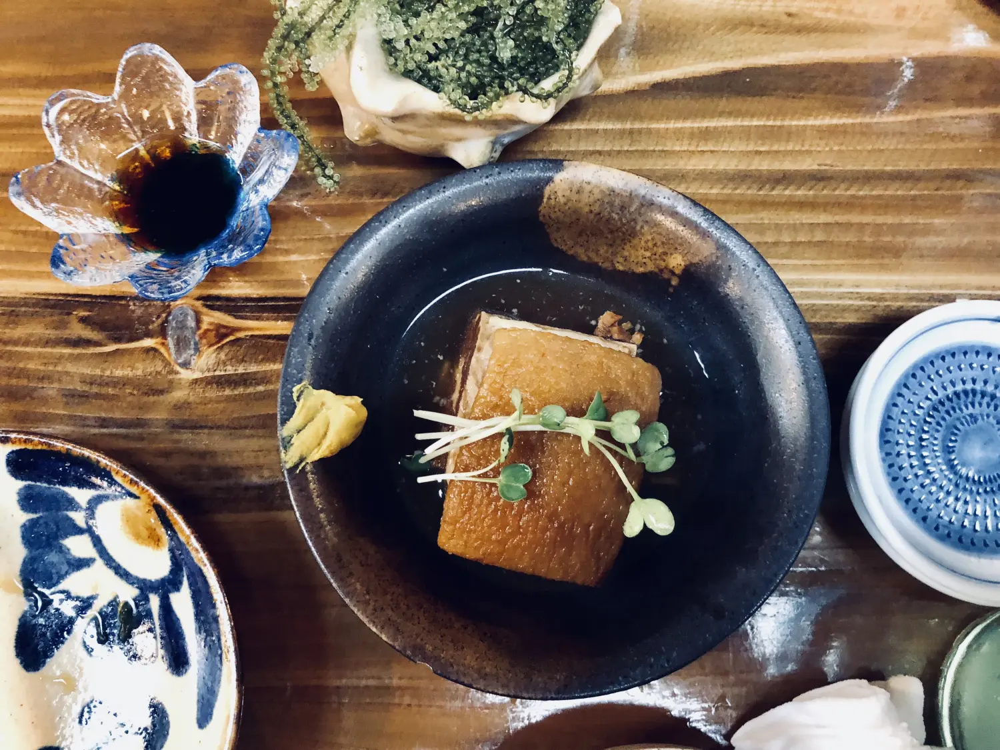

可我怎么看，这冲绳的名物，不就是东坡肉吗？我想起苏东坡的打油诗：无竹令人俗，无肉令人瘦，若要不俗与不瘦，除非天天笋烧肉。M看我笑的诡异，奈何我也无法解释这样的绝句，因为真没有任何语言可以翻译东坡先生的幽默与豁达，想来他也是文史上有名的馋人呢。

苏东坡对猪肉真的很有一手，坊间流传他的一首猪肉颂，开头“黄州好猪肉”。但说“富者不解吃，贫者不解煮”，好吃到果真如此吗？我也无从知晓，因我从没吃过东坡肉。也从没想吃，厚的像一块橡皮，看了总有种想当沙包一样抛出去的欲望。

但理智告诉我那块肉不容小觑。我看着M用筷子，毫不费力地将冲绳猪肉直接夹断了，堂而皇之地吃独食。我内心一阵颤栗，何止是火候，那猪肉恐怕是炖出了主人一身的内功。

## 鱼我所欲也
如果可能的话，每到一个新地方我都恨不得溜一圈菜场。没有哪里比菜场更能反映民生了，场地干净说明人们勤快卫生，食材丰富暗示生活水准不低，物价偏贵看来人们收入也不菲，与菜价水涨船高。

既能填饱肚子，又能免费游玩，还有哪里更比菜场一石二鸟？

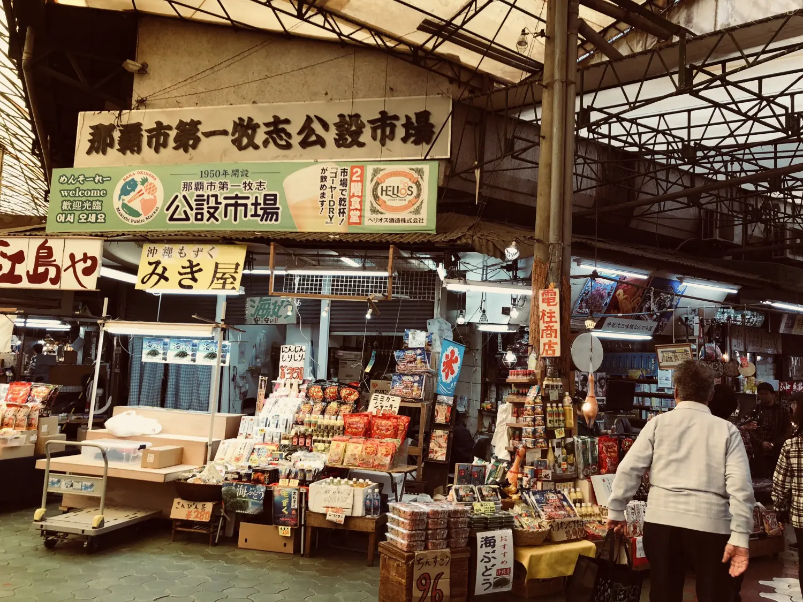

那覇市的牧志市場是一个不管当地人还是外来人都喜欢前往的地方。它的独特之处在于一楼卖食材和生鲜，二楼是各家饭堂。大致走一圈一楼可以看到不少老奶奶在叫卖自己做的渍物、海藻等土产。旅行的人总是成为“被试吃”的对象，稍有一个眼神交流马上就不容分说地就往你手心里倒点小吃，递根牙签，送上纸巾，热情到不忍拒绝。

这是菜场的常态，各国的商贩都很精通“临门一脚”的技巧，幸好航空禁止这铁打的事实总能成功地拦截劈头盖脸的销售。谁知精明的店主竟能在我犹豫之前先发制人：这是真空包装，可以上飞机的哟。这位大姐啊，你抢白了我唯一防身防钱包的理由，让我何以自居。

一楼白吃一圈开胃菜，二楼才是主场。那些卖海鲜的铺子都有自家厨房在二楼处理食材，所以最好的办法就是在一楼亲自挑选喜欢的食物，然后去二楼坐等。

挑海鲜本来就是件麻烦事，更不要说面对这么些陌生种类。龙虾大的怕人，海鱼则过于妖艳。我盯着那条蓝绿色的、极不真实的鱼看了很久，确定似曾相识。

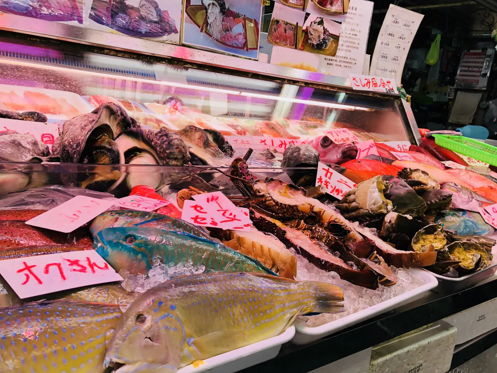

几秒后我翻看了下昨天的相册，想证实自己的猜想。果然，我在“美ら海水族館”看见过它，或它的同类，还曾惊叹它的色彩仿佛电脑合成的效果。

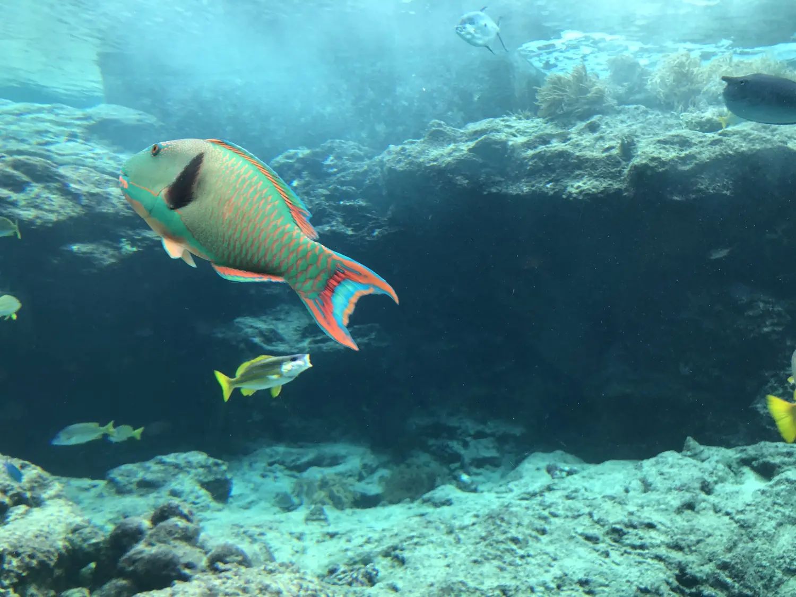

这么美丽的东西真的能吃吗？(本当に食べられる？)

生活中大凡过于美丽异常的东西都是碰不得摸不得，身价还老高。实惠的人还是买条白色的鯛安心，半条切刺身，半条做盐烤。再配两只大虾，和半只海蟹做汤。岛上就是这样，看了好多鱼，吃了好多鱼。

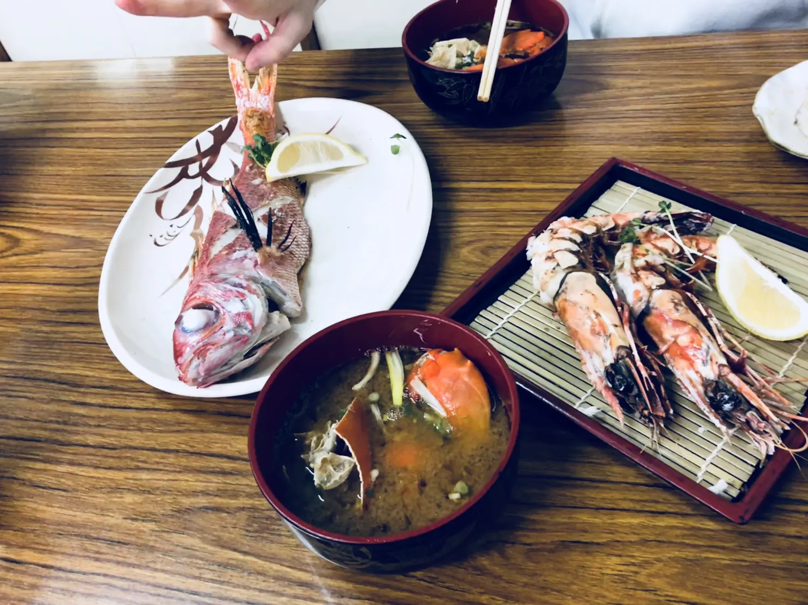

## 嗜甜者独欢
“觉不觉得这里很像某个地方？”

“嗯...龙猫？吉卜力？”

“对，去看看能不能找出来一只。”

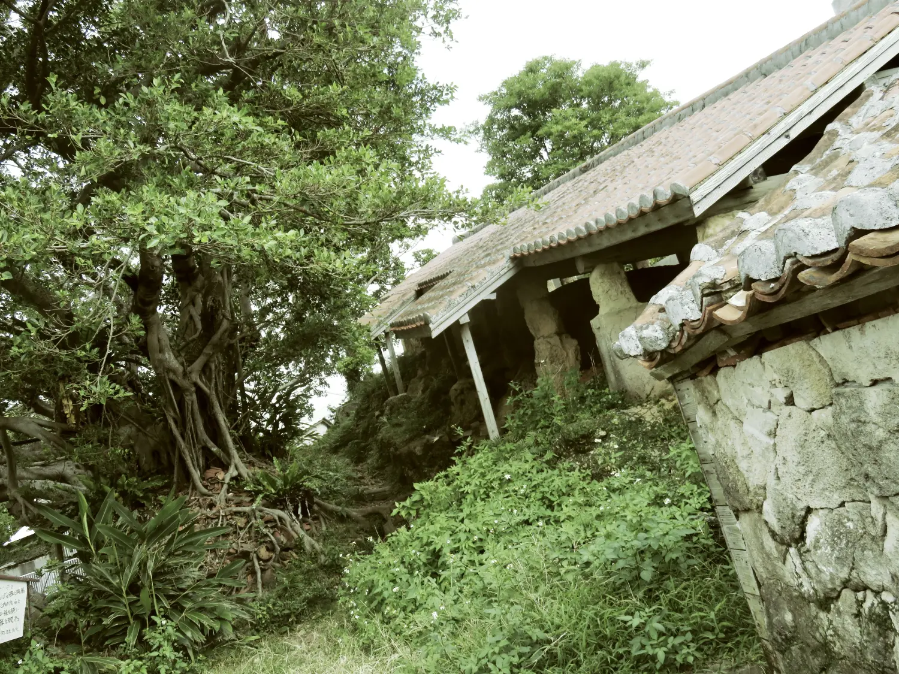

残破的地方一旦杂草丛生倒反而生出一种不得了的神秘感，也就是大自然的力量吧。

其实这里是一个荒废的窑厂，看遗迹是曾烧过不少陶器的样子。旁边曲径通幽的小街叫「壺屋」，所有的小店都卖不同风格的手制陶器，用于食器、容器、或装饰，有不对称的、粗糙的、上过釉的，但每一件都独一无二，不少还都是孤品。

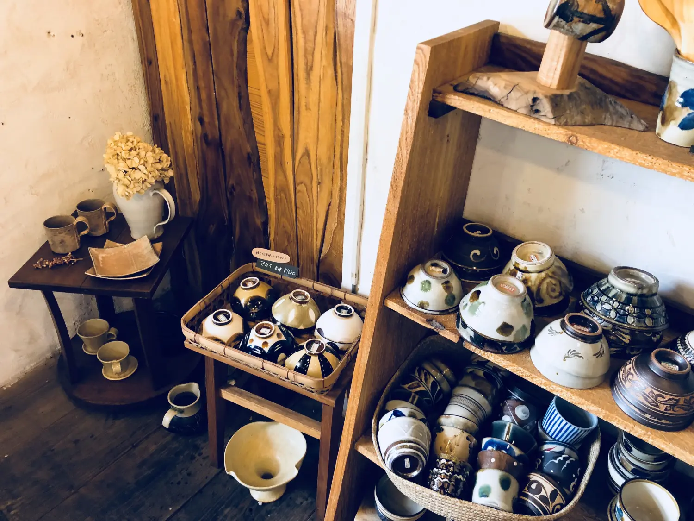

所有的小店还有另一个共同点，就是他们都在不约而同地播放同一种类型的音乐，不管是来自于《幽灵公主》、《风之谷》还是《天空之城》，果然，全都是吉卜力的音乐。我就说我们的第六感够敏锐，那老窑子一看就像是龙猫住过的。

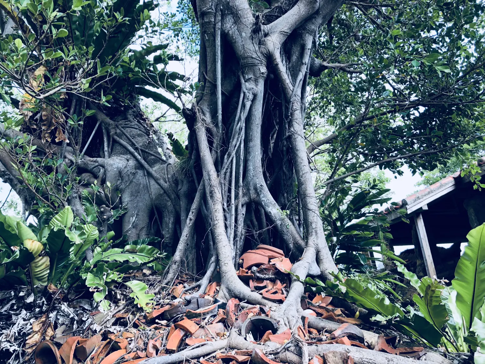

龙猫显然不是俗人能轻易发现的，但我发现了一窝小猫！

其中有三胞胎，旁若无人地打滚，而那只总是对我斜眼，警觉性明显更高的，也许是猫妈。

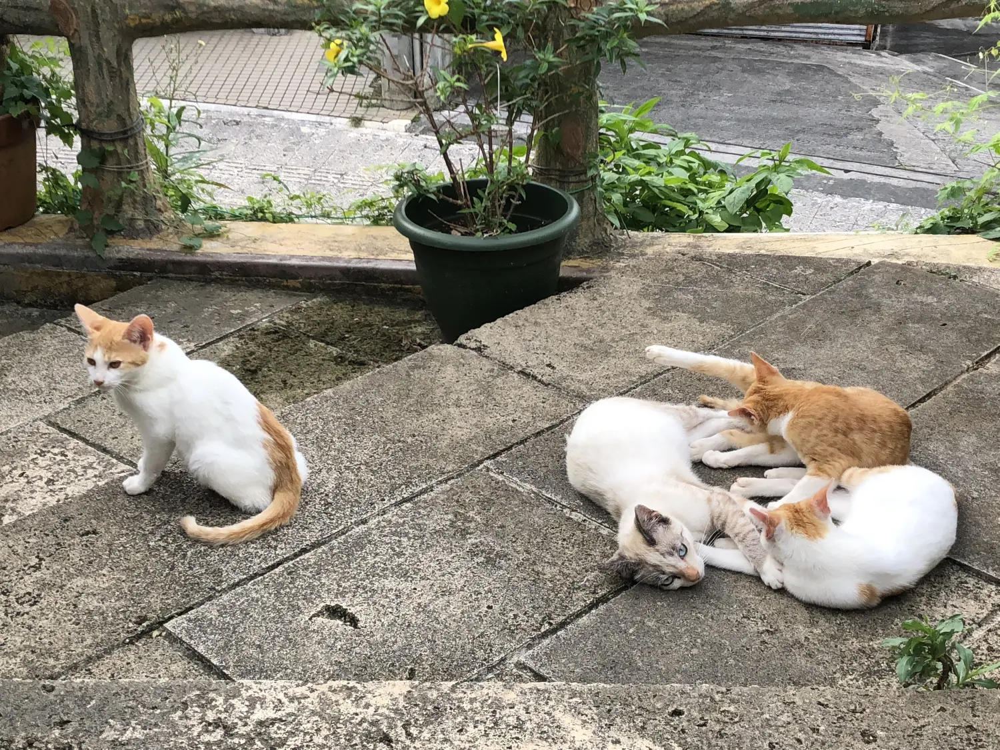

显然我太专注了，而没有注意到旁边的花盆里还有一只黑猫。他看样子像卡住了，也或许就是太舒服，并不想出来。

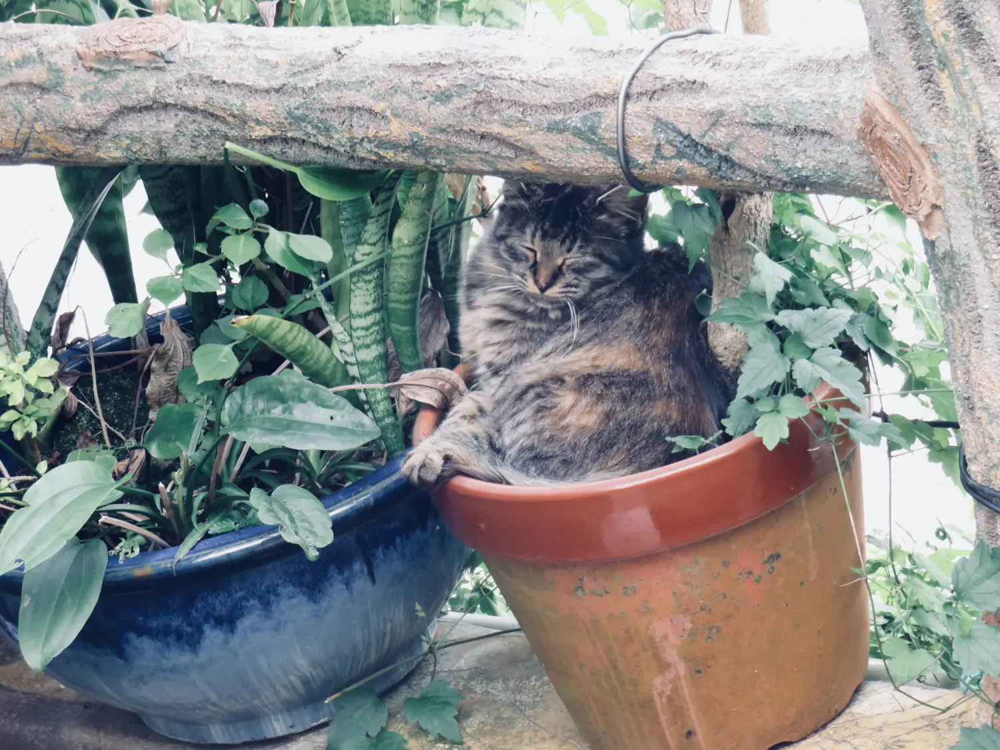

因着这群猫，我才发现了猫的主人和主人的小店，那是一个卖陶器的咖啡馆。店内无人，唯有家主，无人喧扰，窃喜之。场地真的不大，门又小，像个山洞一样。我们要了咖啡和烤松饼，主人说这是特制的，我想这饼的颜色有点深，原来是黑糖的原因。这就是了，冲绳黑糖啊，怎么能忘了这个名物。

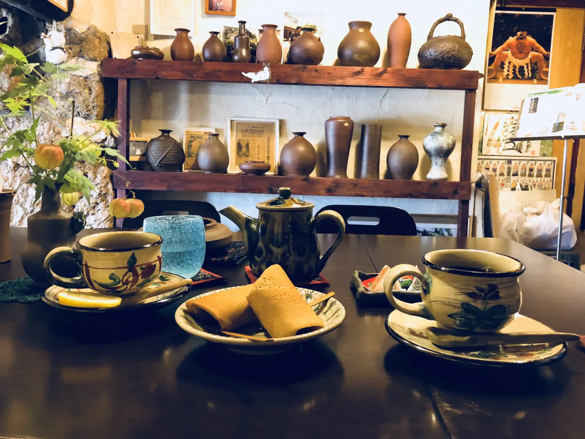

我一激动又忘了这个店叫什么名字，有没有名字都不确定。但如果到了「壺屋」应该是不会错过的，因为那窝猫一定还守着。

## 岁月常相似
当我曾经被告知「一期一会」这个词时，没想到这是个含义深刻的约定。

它源自茶道术语，即参加茶道会的主客皆应诚意，要想到这机会在一生中只有一次。毕竟古人以茶会友，交通不便，反而处处珍惜。所以一期一会的茶道，可不就是一生一次的缘分。

“我一定会很想你的。” 送至安检，我们的航班相差几小时。

“我不想，总添乱。”

“你说下次该去哪里见你呢？”

“天下我奉陪，但，请一定一定带上有效期以内的护照好吗 ？！”

我始终秉性不改，对她说话永远放肆。可不是么，能在一起愉快玩耍的基础，是双方都有掀桌子的能力，和不掀桌子的修养。

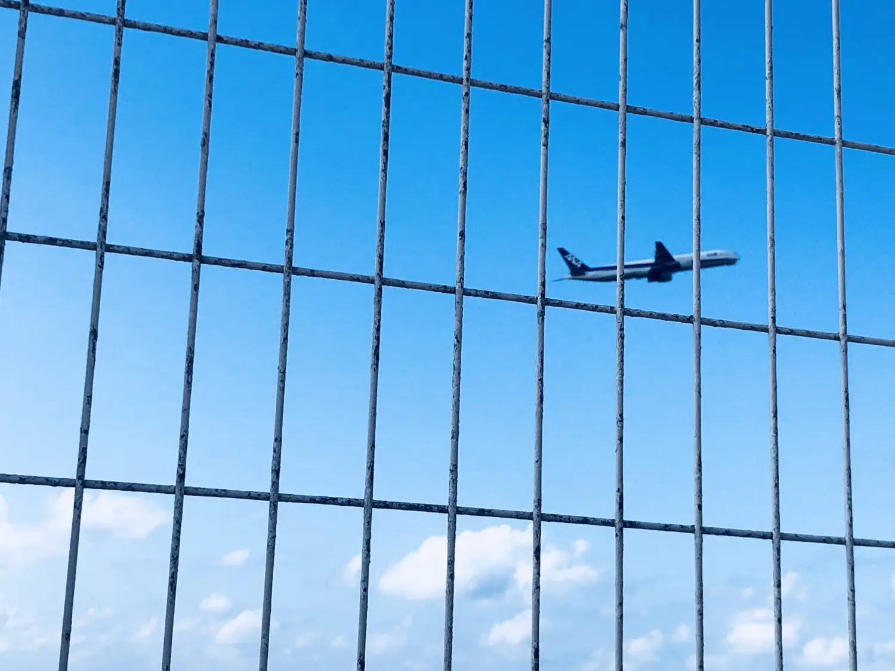