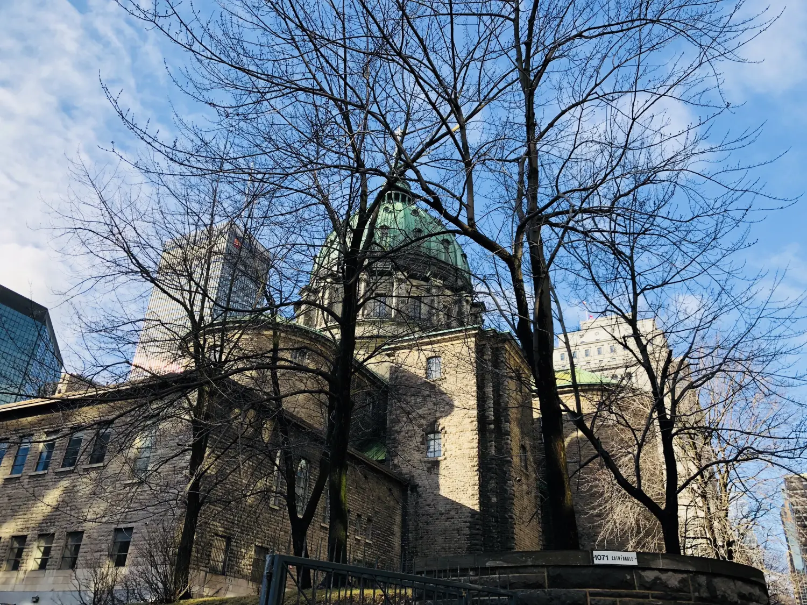
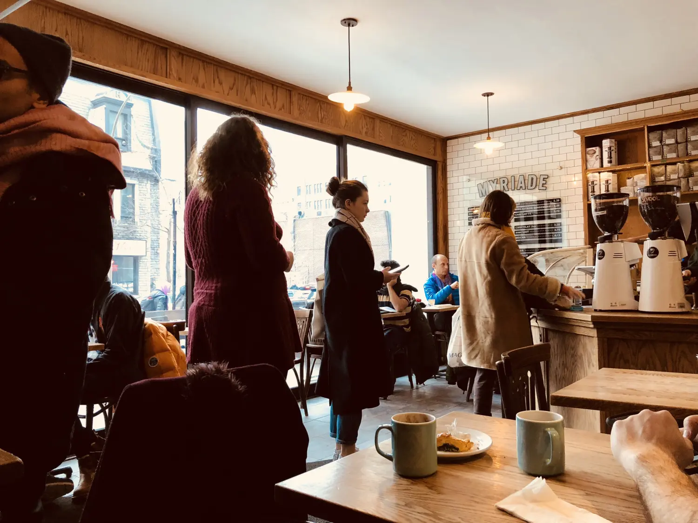
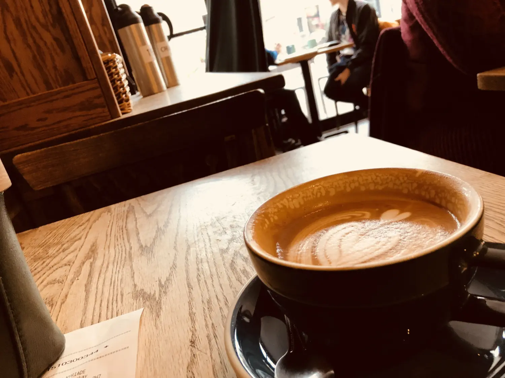
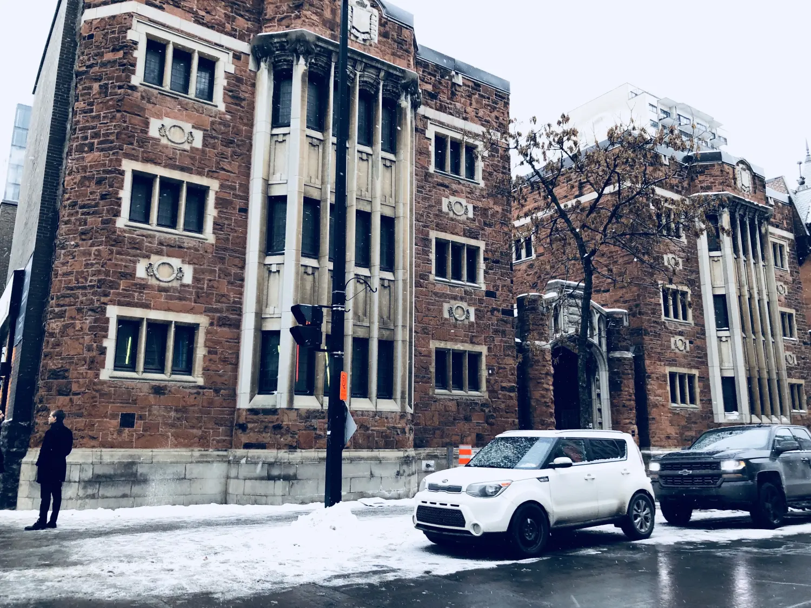
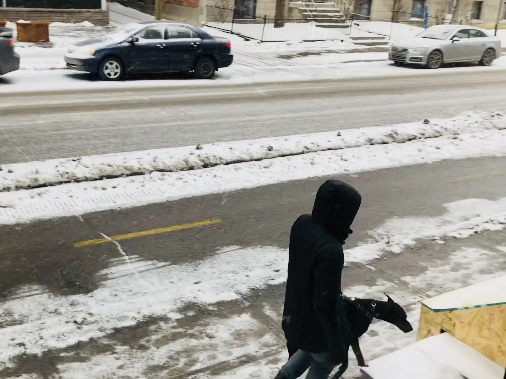
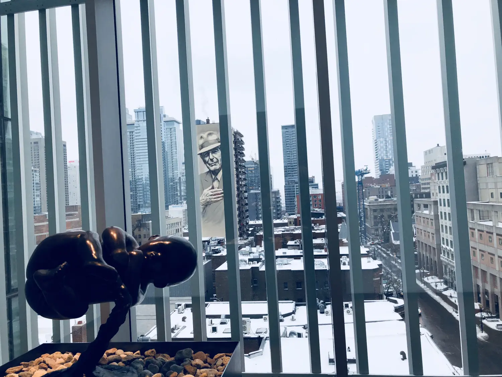
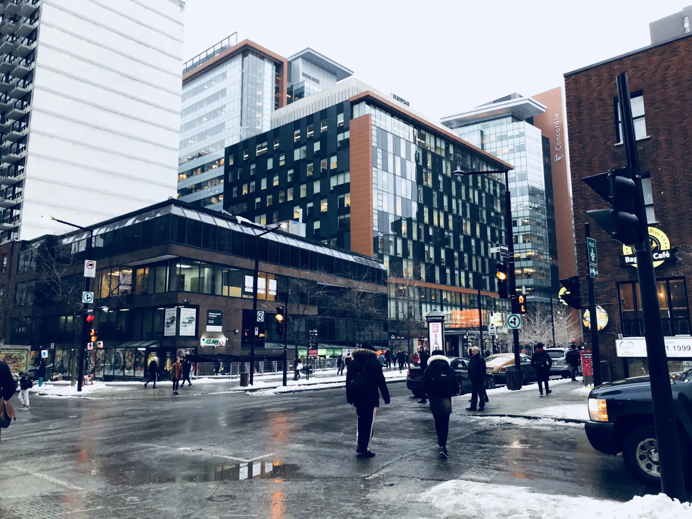
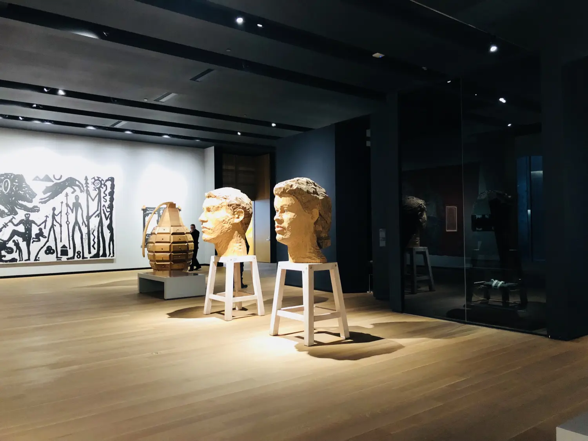

# 无出路咖啡馆

我所见到的每个人，在几句寒暄之后都会问我这个问题 “So 你觉得这儿怎么样？”

“很好，也很冷。” 对方瞬间笑成一朵花，表示赞同，连反应都是一样的。我试着对不同的人说同样的答案，收获的都是一样的哈哈大笑。

从天气找话茬真是百发百中，因为这一点确实达成共识。起初我不过有感而发，道路积雪未化，天又飘着大雪，魁北克天冷是无可反驳的事实。大概在春天来临之前，我都未必能想出一个更有创意的答案。

## 1

雪花常常不请自来。我看准了窗外无雪，于是换好衣服踏出家门，迎面而来的却是速度比我更快的飞雪。下雪本身并不讨厌，干雪飘的像纸片，却没有什么杀伤力。我出门时信誓旦旦地决定去买伞，到了超市门口反而觉得这一路走的挺好，雪花没有打湿外套，我也并没有冻成狗。东挑西选了一堆，什么都买了，就是没买伞。

反正每天都是零下，连天空都失去了下雨的功能，伞这回事就给忘了。如果雪越来越猛的话，直接躲进路边的小店就行，很快也就散了。

某一日，我就这么躲进了一间特别好喝的咖啡屋。在下雪天，好像嗅觉都变灵敏了，它明明门窗紧闭，香气却仿佛从意识进入我的身体。MYRIADE咖啡屋的面积实在有限，我瞄中了靠墙的一张小桌，几乎没有过道可言，但还是容得下我把自己塞进去。

人均空间已经小的剩下半张桌子了，还是有人不断推门。是和我一样来躲避风雪的吗？不，咖啡是真的好喝，狭小的空间反而让香味更加浓缩。

有人虽然点了外带的杯子，但还是站在那里磨磨蹭蹭的放糖、搅拌、加奶，等着哪里有空座腾出来。我存心坐这儿取暖，又怕表现得很不厚道，特别想手头有事可做。电脑可以装装样子，可是着急的任务都被我着急地做完了。唯有文章岂有写到头的道理？于是我把咖啡杯一横：

我在码字！（其实连头绪都还没有）

我在赶时间！（其实并不忙）

别想盯我的座位！（其实我心里是善良的，再让我坐热一会儿就离开）

就在我集中注意力的时候，一个声音打断了我。“你好，你介意我坐在你对面吗？”

我猛一抬头，原来我脚前还有一个椅子，但因为左边靠墙后抵柜台的原因，根本拉不开啊。居然还有比我更能挤的人！要和我分享这片巴掌大的小圆桌。

“好啊。”（我还能说什么）“那我把桌子往我这里拉一些吧，你就好坐了。” 这下子，桌子彻底把我顶住了，我慷慨地给她挤出了半条腿的距离。

“啊，太谢谢你了。” 说完她居然拿出了电脑！我们桌下脚挤脚，桌面上电脑还要背靠背，像两个争分夺秒的宇宙“大忙人”。在她的掩护下，我感觉踏实了不少，你说谁还好意思打这两个人座位的主意？于是我安全写作，本篇就是这么在畸形的心理斗争中诞生的。

咖啡冷了，雪不见小。我的杯子里每次都故意剩下最后一口，喝个精光还不走人就太尴尬了。

## 2

下雪本身并不讨厌，但雪后一宿的地面却很危险。冻雪在个别路段特别滑，蒙特利尔冬天的医院每天都会收到跌打损伤的病号，多则几百人，全部都是雪地滑倒。听到这样的新闻后，我尽量沿着被踩出很多脚印的痕迹前进，那都是被群众们验证过的安全通道。

终于有一天，我的必经之路被红色警戒线围住了，红线上是连续重复的黑色单词danger。我一阵心惊，肯定是有人摔得不轻才报了警。而我以为很安全的道路也没有那么安全。人都劝我保暖，但相比御寒，防滑才更重要。

雪天把一切都衬托的无比明显，包括流浪汉的身影。最近我认出几个熟脸的流浪汉，每天跟上班一样定点扎在自己的地盘上乞讨。在元旦前夕，乞讨的花样也不少，他们和每个人说新年快乐，或在瓦楞板上写着Happy New Year。

有一个老人站在地铁站门口，为进进进出的人开门问候，行色匆匆的人总喜欢把手插在口袋里，如果刚好兜里有硬币，大概就会顺手放进老人左手的纸杯里。天色稍晚时我又经过了那个站，发现老人还在那里开门。那个地铁的推门又重又冰，我对他产生了一瞬间的敬意，他这样的微笑服务和酒店门童的工作性质又有什么区别？

发达国家的无家可归之人好像更多，再好的福利制度都无法惠济众人。从什么时候开始，北美的新贵族变成移民群体了？也就几十年而已。严歌苓的一部小说叫《无出路咖啡馆》，背景是上世纪的美国，外来人口与白人的等级可谓云泥之别。我记得严在书中形容，在那个年代留学生三个字就是穷人的代名词。那本书多少有点自传的成分，只有经历摸爬滚打的人才知道怎么倔强地活下去。

严的小说我几乎每部都喜欢，这一本尤其印象深刻，因为身份和地点的代入感极强。顺着她的线索，我理解其中一切的物质、财富、精神、爱情、尊严、背叛、真实、期待。从此刻的角度去看历史有一种匪夷所思的真实感，但严歌苓是个狠人，结局还是无出路。

## 3

我恰巧在新年的假期内降落了蒙特利尔，租房难如登天。客房我只订了三晚，隔日又昏睡了大半天，时间并不足以我四处看房租房。加上房东们基本都在放假，发出去的消息要么石沉大海，要么安排节后接待。

Checkout那天是12月31号，而我必须在一天之内租到房子，因为跨年前后的大小酒店一刷水的满房，就是再想捡漏，房价也是翻了三番，活生生地拿标间当套房卖！

好不容易有一家邮件回复的公寓。酒店退房后我直扑它一楼的小办公室。那个女人说再过几小时到五点她就下班了，然后她要休一周长假。我立刻警觉，再不抓住这最后一根稻草的话今晚该何处下榻？扭回去住套房价的标间，连这想法都让我痛心疾首。

房间比我想象的大，虽然月租比预想的贵但第一个月免租金，水电暖三包，倒腾一下也差不多，再说我还有选择的余地吗？于是看完房我们就直接准备签契约。

那个女人问起我的当地账户，我说我才来两天，连银行还没去呢。她迟钝了一会儿，大概是从没见过这么风风火火找房子的人，她面露难色，我心惊胆战。而后她却问了一句毫不相干的话：“你之前在美国住过吗，是否有地址呢？”

“有是有，但这有什么关系呢？” 我一团乱麻。

“那就方便多了，这样我就可以查你的信用记录。” 这两个国家果然是在很多方面不分彼此。

我只知道信用记录在西方是个决不能马虎的凭据，对它的肤浅认知还是来源于小说。《无出路咖啡馆》里有一段FBI和主人公“我”的对话就是针对于此。

FBI怎么也掏不出“我”的老底，很吃惊： “你没有信用可查，可是为什么呢？”

“你看，好几家银行动员我申请他们的信用卡，可我一申请他们都回答说：对不起，我们无法查到您的信用记录。”

“换了我也会给你同样的回答，所以你必须建立信用记录。”

“那这得先借钱，然后按期还款。可你跟任何人借钱，他都要看看你是否记录良好。”

没有信用记录就不能贷款，可不贷款又没法建立信用记录。这可不就是典型的“第二十二条军规”？

“这是你在美国的地址吗？” 一个声音似近似远地传来。

“啊，什么？”

“请核对一下你的地址。” 那个女人继续敲打键盘。我有时，竟然可以在一个离我那么近的人面前走神走的一塌糊涂！

我大致扫了一眼所有条约，然后很用力地签了个名，差点戳通了纸，拉回了所有游离的思维。

女人给了我钥匙，送我进门。来的路上我还在想“押一付二”那些行话，现金不够怎么办，要怎么交易等等。一切结束时才发现，我不仅没提前交房租，连押金都不用，加上首月免租，我半毛钱都没给就拎包入住了。

末了，我还是想起了书上那段，联想被打断的后文是：没有信用记录，你这个人等于不存在。

## 4

住处有了，但我还是没有大功告成的感觉。没有床，不能躺；没椅子，不能坐；有冰箱，是空的。

当时下午两点左右，五点钟所有的商家都会提前打烊，元旦还要关门一天。我立刻出门，三小时我得搞来一张床。大件不好办，我想好下策，大不了买一个野营睡袋把自己绑两晚。睡袋没找着，我倒发现了充气床垫，充完后尺寸竟然比床大。

我不停的往返于公寓与最近的商场之间，好在距离不远，我一路跑去再手提背扛地运输物资回头。时间一分分地过去，下班的人流量越来越猛，所有人归心似箭，等待跨年。为屯粮而买菜的人顿时多了起来，超市收银员来不及抬头，扫码的手速越来越快，他在算着自己还有多久就解放，我也在算着还需要再跑几个来回。

离北极圈近的地方天黑的早，四点半就开始亮灯，我这才注意到一排大树上绕满了节日的彩灯。流浪汉们抓紧最后一波人流来乞讨，因为他们也迫切地想过个好年。时间够我最后一个来回的冲刺，买床单买毛毯，买窗帘买厕纸。那天那么把时间当命赶的，就是流浪汉和我，只不过他为一晚，我为一年为一生。

现在让我再拿出那天的劲头是怎么也办不到了。隔天开始肌肉疼，比做了几十个深蹲还酸爽。没有了紧迫感，意识就松懈了，东西只能慢慢买。今天拎只水壶，明天提个拖把，有空带走衣架，偶尔再买几个漂亮的碗，烟火气在蚂蚁搬家中一天天产生。我本来就打算这样不紧不慢，哪知火灾现场出蛮劲，那天的超人体质一去不复返。

## 5

并没有很多人知道我的去向。下飞机后我在脸书上check-in了机场坐标，估计这就是我暴露了行踪的原因。隔天我收到了一条令我诧异的信息。

“嗨，你还记得我吗？你在蒙特利尔吗，我在多伦多，希望可以再见一面。”

这到底是谁。名字完全提示不了任何记忆，但若不认识的话怎么会在我的联系人里。打开对话后我把屏幕往上滚了几行，上一次信息，居然是在2013年2月9号。

我想起来了，在小城贝藏松的车站我迷路了。我可以想象自己曾经有多菜鸟，是这个法国人教我怎么转车，再坐哪个火车去南部的。临走时他说下次再经过贝藏松的话还可以找他，我非常礼貌地回复了好并感谢了他的江湖救急。

说来这确实是一个很客套的约定，这约一爽就是五年。世界竟如此之小，但我们萍水相逢，只能后会无期。

发信息可以掩饰记忆上的漏洞，话题居然不尴不尬地接上了。几句寒暄之后，果然，人见人问的大问题又来了 “So 你觉得这儿怎么样？”

“很好，也很冷。”

我当然看不见也听不见他有没有笑。但随即叮叮咚咚发来一串大笑的表情包，我笑了。