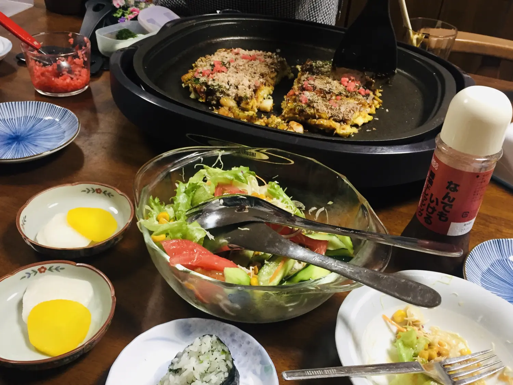
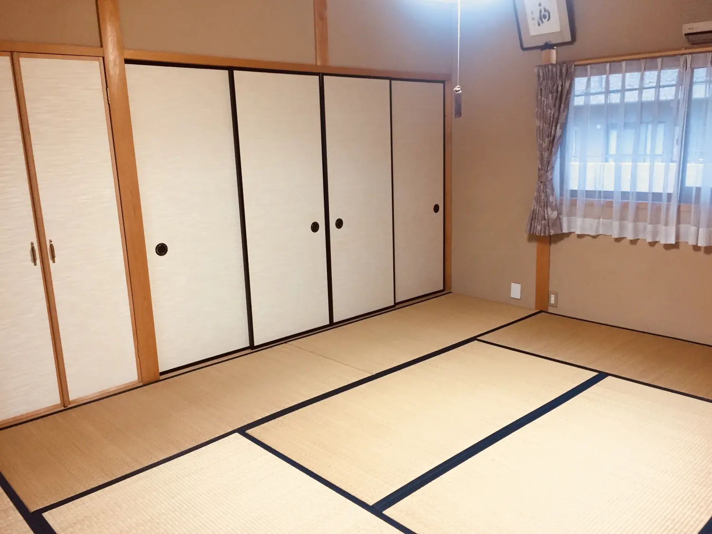
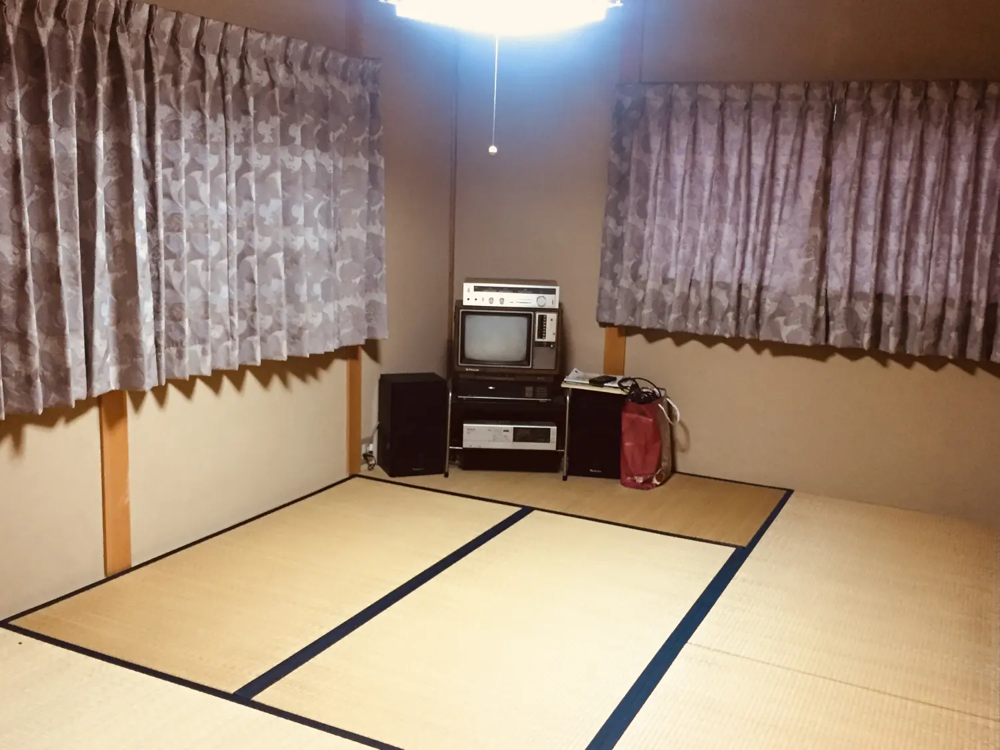

# 往事并不如烟

现在的我与北京时间相差十三小时，与东京时间相差十四小时。我只对这两个时区有所牵挂，因为那里有重要的人。

两三周前的早上，我被一条消息叮醒。大意是“你的地址是什么，快告诉我。”

我居然一睁眼就看到一条祈使句。大脑条件反射，手指迅速回复，紧接着我又睡眼惺忪地倒下了，再次起床后我并没有追问这个事情的缘由。直到几天前我收到邮局的提示，有包裹待提取。我一想便心中有数，周围如同掀起一阵胜利的狂风。这样就对了，我知道在我过生日的这个月里绝对有东西值得期待，不管我们距离有多远，时差有多久。

从邮局带回包裹，我拿起剪刀裁开纸箱，猜不到里面是什么，第一个掏出来的是一袋铜锣烧，再往里面一看居然一箱全是日本零食。明明只发一句问候我也就开心了，但手写的贺卡显然胜过一切表情包，我偶尔还是个怀旧的人，更别提这一箱都是我喜欢的。明明只比我大两岁，真把我当孩子了，我却总是被无理由娇惯的那一个。

我与M的时差是14小时，虽然我很想报告包裹已收到，但还是决定等她时间稍晚时再骚扰。时差这个本没有太大意义的概念因为牵挂而有所不同。一直以来我们的关系如同后天亲人，我能看得远感悟多，很大程度上是因为我是被带领的那一个，被照顾的那一个。

我第一次去名古屋的时候，M说要带我去她外婆家里。

“我又要住你父母家，还要去看外婆，怎么像被你带上门的女婿。”

“...... 我外婆住的是和式的屋子，这样的格调在城市里很少见了，我怕你以后没机会见到。”

于是我带着一股猎奇的心理去拜访。M却说：“我外婆很古怪，独来独往，家人都不太喜欢她，我也不喜欢。”

我大吃一惊：“呀，那你还带我这个外人来干嘛？”

“没事，参观房子，她只是对家人不亲近，反而对外人很有礼貌。”

我猎奇的心理更上一层，外婆这个角色在我印象中从来不是这样的。一路上M给我做足了铺垫，结果我构思了一个冷面犀利的老婆婆形象，暗自决定一切言行举止都要谨慎。

脑海中挥之不去《千与千寻》的汤婆婆，我真的比上门女婿还要紧张。迎接我们的却是一个满头白发但精神爽利的老人。

“你外婆多大了？” 我想悄悄确认眼前的疑惑。

“八十多岁了。”

“不像吧，她怎么感觉化妆了？我的天！”

惊喜接踵而至，香味四溢，要有大餐招待。一个老人用这么大厨房，我都有些羡慕，而且她什么工具都有，我一进餐厅就看到桌上的平底电锅，这是要自己在家做“大阪烧”的节奏！

外婆准备的食物之多远远超过我们的心理和生理的双重承受能力。一开始腌萝卜吃多了，味增汤一大碗，一人给烤了两个大阪烧，还问有没有吃饱！又给捏了好几个饭团。我与M的对视中是心领神会的互相嘲讽，看吧，平时半碗饭都喊撑的人，不知还藏有这样的洪荒之力吧，这一顿估计是把一周的碳水化合物都吃够了。

且不说每个人的外婆个性有多不同，但在对儿孙的吃饭方面都是一样的大公无私。外婆们说“吃啊，还有很多”是实话，而孙女们说“真的吃不下了”也是实话。半推半就，终至极限，外婆却问“还有点心，吃不吃？” M是吃不下，我是放不下，我想吃又吃不动，真是好伤心，恨不得少喝一碗汤，多长一个胃。

说到本次主要行动是参观房子，于是我把人家每个房间都看在眼里。房间全是榻榻米，木格窗上糊的是纸，很轻，上下一拉可以和院落形成隔断却依然通透，果然好传统。

但有一个疑惑从我一进门就产生了，这个家大的出奇，可以住一家几口，却只有一个老人独居。

“为什么不一起住？你们家可没这气魄呢。” 我甚至觉得这房子不拿出来当Airbnb名宿租出去都可惜了，地方大，有个性，闹中取静，一晚房租如何如何。

“因为外婆古怪啊。”

“你外婆到底哪里怪了？” 吃饭时我并没有觉得眼前的外婆和孙女有明显的隔阂，也许M说的没错，外婆待人接客很成功，从外人眼中确实看不出任何不协调，但偏偏外人看来美满的东西只有自己清楚哪里别扭。肯定有我短时间内看不见的东西，那就是原因。

“大概是生活合不来吧，爸妈早就搬出来了，宁可自己买小房子住。外婆的生活可挑剔了，每天早上都去洋食屋吃早餐！” 每天早上？这个外婆的仪式感实在是太强大了，晚辈不及。

“那她的开销呢？生活费之类的。” 我很好奇她如何这般自由，因为我的外婆是个苦命的角色，永远都是考虑他人忽略自己，明明自己也没有，但就是硬撑也总想供应儿孙。剥削自己成了她岁月中的习惯。

“她有自己的钱，儿子不止我爸一个，只是谁也不给罢了。但是这样也好，大家知道她自己过的自足反而安心。” 我恍然大悟，难怪家人不待见，因为这个外婆不“奉献”啊。

转而一想又好心酸，原来老人自己可以过的很好，到底是谁在拖谁后腿？下一代如果不能集体承担赡养老人的责任，不如不要觊觎老人的财产，最公平的做法就是谁也得不到，给老人自我支配的权力和自由。显然，这样缺少了一些天伦之乐，但不同社会有自己的运作方式，日本是个老龄化严重的国家，老人待遇自然差不了，但年轻人税务则更重，可是与其纠纷各家的赡养责任，不如大家的老人大家养。

我们就那样坐在一间和室里聊房子背后的故事，外婆推门，带来甜点和绿茶，刚才吃不下的和菓子终于还是被我盼到了。不一会儿，外婆自告奋勇要给我们拍照，但怎么也摆弄不了自己的手机。前后准备了快十次，不是拍到桌子就是手抖，我已经脸都笑僵了，等外婆操练完毕，那僵硬的照片估计也是不能看。

“咦，我怎么什么也看不见呢？”

“阿婆啊，你自己手指挡住镜头了。” M回答之飞速如同早已预知一般准确。我想她不管多么特立独行，她终究还是个老人。老人的固执，老人的可爱，她对自己模糊的作品相当满意。

回去的路上，因为吃的太饱，所以只能散步，我们一路接着说这个外婆的奇葩。

我说：“外婆会把我们的照片发过来吧。”

M说： “怎么可能，她连手机都不太会用，今天破天荒拍照，我也是头一回见。刚才没要也就算了，再要估计就得我自己来取，但我不想再来。”

“嗯，我懂，你不喜欢她。”

“哦，我都忘了说，为了带你来，我可是要提前一周和外婆预约呢。”

“预约什么啊？” 我以为自个儿是VIP，不至于吧。

“时间呐，她可是很忙的，她也有自己的老姊妹啊，没事去喝茶，还总是去逛名古屋最好的商场。你看，什么事都有可能发生，就是不一定会在家。”

我竟无言以对，不禁对这个自立自强不活在子女眼中的老人再次刮目相看，也许别人有意见，但她自己一定过得很舒服。但这也没错，那个社会的准则只要不妨碍他人就是正确的，是好是歹，反正别人总有意见，但至少这样她会更喜欢她自己。

我实在禁不住把我们的外婆对比，因为差别实在太大了。无言以对的那一瞬间，我脑子里只盘旋着一个念头：我的外婆啊，我的外婆啊，我多希望你也自私一点，再自私一点。

“她要我精确到几点，才好提前准备食物。唉怎么就是不喜欢她呢，我第一喜欢妈妈，第二喜欢你。” 我半晌说不出话，被当成亲人的感觉真好，但她不知道我其实心生羡慕。不管这个外婆奇葩也罢，古怪也罢，喜不喜欢都无所谓，她还是在那里的。如果可以，我也想预约，可我怎么预约我的外婆？天堂是否接受预约热线？

外婆已经过世。

我没有看到她最后一面，所以一点都不真实，只是像面对考试那样接受了这个铁一般的事实。偶尔回家时，发现一个人就这么突然不见了，但我还是难以想象，因为她至今留给我的音容笑貌还是颇为健康的身姿，谁都没有想到她会突然离开。

我不刻意感伤怀旧，总以为往事如烟飘散，往事却在不经意间刺痛我心。前年在深圳当了一段时间的动漫老师，某天有人给集体点了一批小馄饨的外卖。嘈杂中大家吃的热火朝天，我突然边吃边伤心，小馄饨是外婆对我的特例。我一直讨厌猪肉，但小馄饨的胡椒味重，结果鲜味盖过了猪味。那时老家没什么我爱吃的，外婆总去买馄饨，买一锅熟的，拎一袋生的，连卖馄饨的人都知道那是给她孙女准备的。

我从来不知睹物思人竟有如此强大的威力，我却再也不吃小馄饨了。

我甚至不想看到那种老式的钢精锅子，因为外婆总用那同一只锅去装馄饨。总以为往事如烟飘散，往事却日久弥新，锅子两端黑色的把手松动无比，手指一拨就咕噜噜的直转。

我记忆中什么时候刻意保留那只坑坑洼洼的旧锅了？

往事并不如烟。