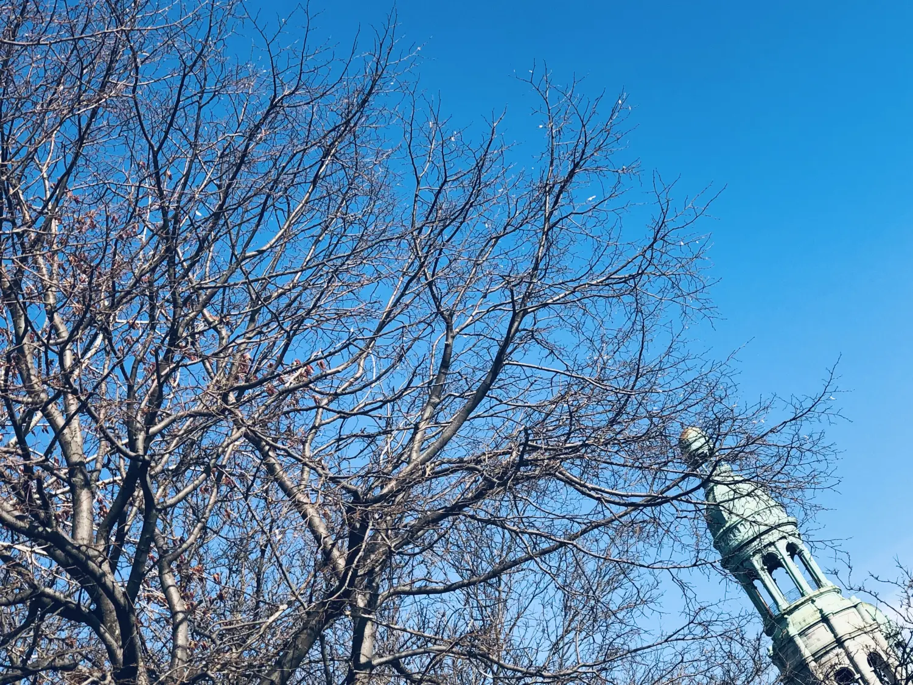

# 无常皆日常

我总说魁北克的天气变化之无常，春天看似遥遥无期。几乎每周都有气象预报说下周有望踏入春天，但总是坚持不到周日，然后中途一股寒流，刮走了几天阳光般的恩赐。隔日冷风冷雨又不打招呼，才脱下的衣服都来不及穿回去。

当客观日期已进入春天的时候，主观感知还停留在冬天，可悲的是大楼的公共供暖系统却不以人的主观意志为转移，暖气按照节气规定说结束就结束，都不知在哪天就被一刀切了，只记得某日我起床后鼻塞，当天就开始感冒发烧，我感觉不对劲，一摸暖气片，果然，凉透了。大概是上个月中旬我倒下了，死扛了一周好转，两周复活。感慨万分，我悉心保养了一整个冬天，自豪没有任何小病小痛，却不曾料到自己竟然倒在了春天的起跑线上。

时间就是不可思议的解药，一切的答案都是习惯就好，无常也会变成日常。天气无常，我不敢奢望，但最近是真的变暖了，我姑且就再相信气象预报一次，下周有望踏入春天！

冬天的那几个月，我无心欣赏这个城市的面貌，因为天冷时什么都看不见，什么都不想看。眼睛不知往哪儿瞟，大概在瞟哪里可以挡风遮雨，于是赶紧缩头弓腰钻进下一个有屋顶的地方，每走快一步，就多享受一会儿室内的暖气。

天冷时，近在咫尺的人和物也不入眼，全靠习惯指挥往哪儿走，眼神只是辅助。偶尔多看一眼，那人好面熟，昨天好像也在这里用问好的方式向人乞讨，也许前天也在这里。他习惯性地重复自己的动作，我习惯性地与他擦肩而过。

天暖时，我猛然发现视线都变开阔了，同样的路居然产生不同的景致，仿佛几个月我才开了眼。道路和天空都在变，但变化最大的还是人，走路的节奏都变慢了，和天冷时横冲直撞的原则一样，每走慢一步，就多享受一会儿奢侈的阳光。

一旦习惯了冷天的无常，阳光灿烂的日常都足以成为一天的小确幸。

渐渐地，我发现自己愿意在室外呆更久，开始坐在公园长凳上，自然地会扭头看天，脖子终于也不僵了，体内外因素都在说明温暖的气候即将成为日常。我看见曾经看不见的，听见曾经听不见的，城市都瞬间变好看了。城市也许从来不变，但若不观察，再美的地方也没有风景可言，简直白长一双眼。可惜人们并不观察自己的日常，更不要提审视。

刚来蒙特利尔的几天内我写了第一篇[《无出路咖啡馆》](/无出路咖啡馆)，想想也真是巧，几个月后我居然又进入了同样的心境。我选择了一个可以看到所有座位和吧台的桌子，这样我可以随时观察来往的男男女女老老少少。虽然我在看一本书，但这不妨碍我大大方方地观察他人：有人高谈阔论生意往来；有人三五成群聚众聊天；有人低头耳语分吃一份甜点；有人坐在吧台旁自言自语；有人独自品尝，一口一口吃的十分认真。看这个人吃东西真是有种莫名的治愈感，切蛋糕整齐而细致，抿一口还要再把叉子舔干净，端详一眼，再切下一刀，我几乎想冲上去问：你到底吃的什么那么香？

人果然还是有第六感的，吃的就算再忘乎所以还是会发觉有人在偷看。我立刻把头扭了一大圈，好像在缓解脖子疼，再稍微自然地把视线收回到……不知道看到第几行，还辛亏我手上有本书。

周遭时而喧闹一阵又归于平静，你都不知观察人类有多有趣，尤其是他们不知道的时候，这就是日常。我决定下次还要坐在视线一百八十度开阔的座位上，这才是堂吃的意义。