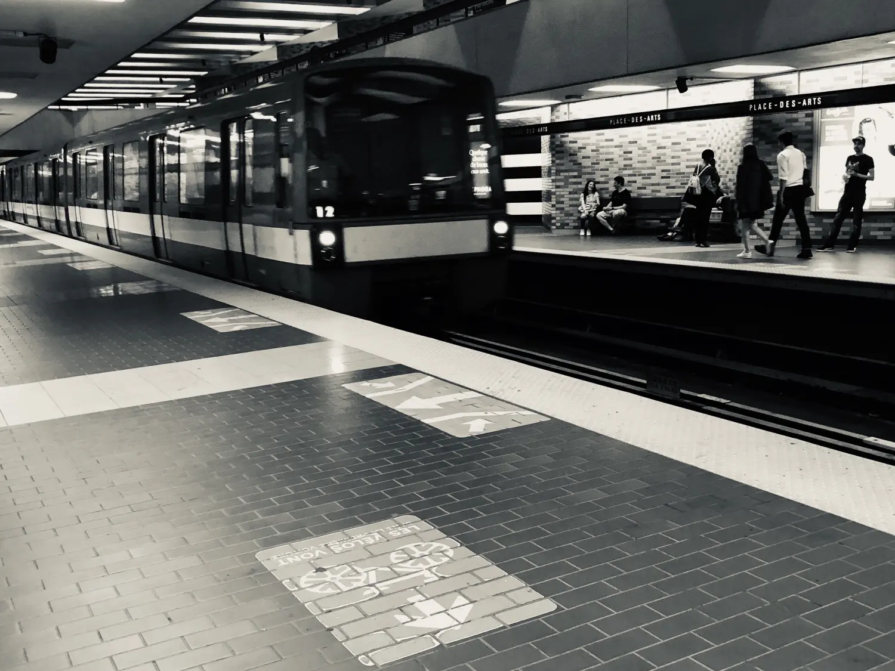
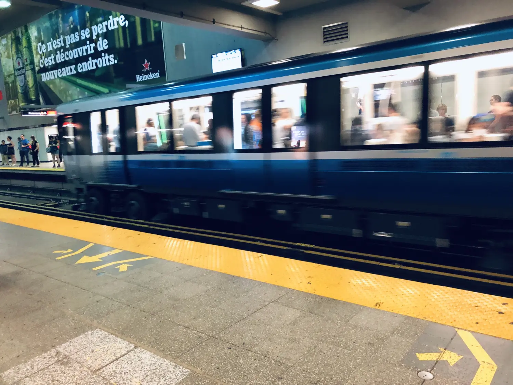
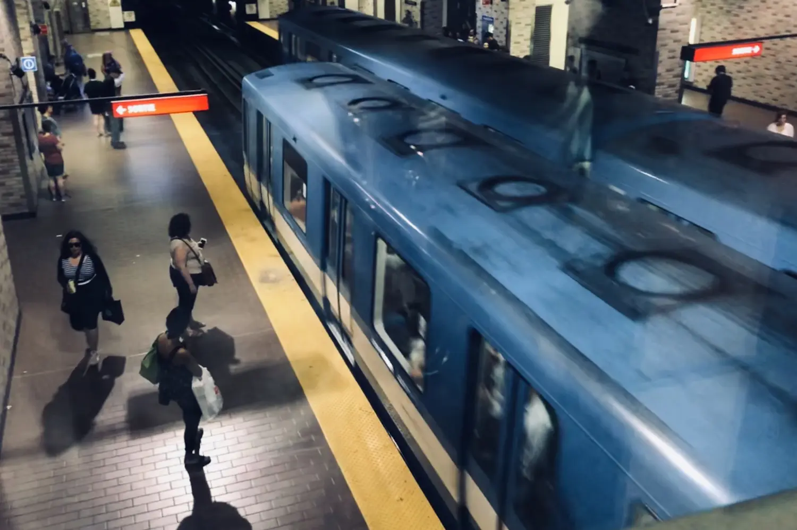
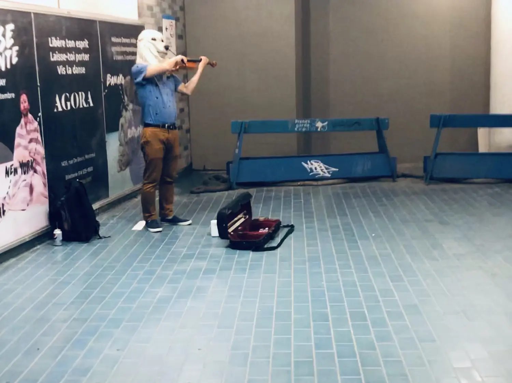

# 君子贵人贱己，先人而后己

地铁是个几乎没有人情冷暖的地方，全世界的地铁都一样。站着的人想坐下，坐着的人想出去。

厢门打开，一同上来几个无聊的面孔。我刚准备坐下时突然看见一个头发花白的人走进来，正义感突如其来：让个座吧。我以为老人都是想坐的。我投以期待的目光，起身，台词还没说出口，老人却立马看向我，严肃淡定地说：Non non，sit！（别，你坐！）

确切的说，我那状态都不能叫让座，是让座的未完成时。我只不过是把正准备坐下去的弯曲的膝盖瞬间蹬直了而已。老人看我有让座的态度，已然不爽，固执地站着，我竟无言以对，克制一闪而过的尴尬，乖乖地坐下了。

哎哟你不坐正好，你老就该坐吗，我年轻就该让吗，我这忙了一天累死了，坐下歇歇正好…… 猛然间我意识到这不知从何而来的琐碎的牢骚，或是自我安慰。看着车窗里自己的倒影，我真的是想帮助别人吗？还是喜欢帮助他人后的自我感受良好，哪怕只是一瞬间的小小的自我欣赏，重点却是助人为乐的“乐”字。

但是，别人不一定需要或接受帮助。那么，在善心得不到认可或接纳时，原本积极的心情竟然会慢慢累积成负能量。

地铁是个几乎没有人情冷暖的地方，最穷的最臭的都聚集于此。起初我容易有恻隐之心，久而久之发现了不少职业讨饭的熟脸，也许有的人是真穷，也许有的人是装穷。一些无业流民终日靠乞讨消磨时光。

站台上等车的人或站或坐，那张熟脸便随着人群一条边的问过去，但这样的游击战基本收获浅薄，毕竟大多数人对其置之不理。不远处一个坐着的老者也未搭理，他失望地继续向前走，没走几步却扭头大骂了老者几句。我惊得赶紧收回了观察的视线，直视前方空荡的铁轨，仿佛什么也没听见。

这世界简直是要造反，好人难当，不说话也挨骂。再遇到这些人真得戴上耳机，装聋作哑，装死装睡。我本来走路习惯就很快，现在走的更快，快到连讨饭的跟不上也喊不动。

也许我走的还不够快，我竟然被一个老婆婆拦下了。我甚至没注意到视线里这个矮小的身影，她猛的一扭头就张口喊住我：“你能帮我拎一下吗？” 让我走路也能踩出急刹车的感觉也是绝了。老婆婆停在下行楼梯的地方，身边一个巨大的购物袋，估计是已经拎不动了。当时我走的很快，还戴着耳机，旁边那么多经过的青年壮汉她不喊，偏喊个姑娘来提重物，这阿婆是多么缺乏眼头见识。

病急乱投医，也是因为需要帮助的弱者会主动请求帮助。我估计地铁快进站了，心想时间宝贵，于是我果断地帮她拎起袋子就往下走，到底才发现阿婆还徘徊在第四台阶。真是不好意思，我怎么力气那么大，也没等一下老人家，看来这几年拎行李的本事是锻炼了不少。我目送老人侧着身子一步一个台阶地往下走，她尽最大的努力往下挪。台阶下了六七级，她也边下边说了六七次谢谢，绞的我心里一阵难过一阵高兴。

地铁很快进站，我故意站得离她稍微远了点，但我还是非要看着那老太进了车厢才自己也进去了，感觉好像这样事情才圆满了。

地铁是个几乎没有人情冷暖的地方。出于无心之举，看似举手之劳，却开心得莫名其妙。这谈不上乐善好施，也算不了品德高尚，只能说搬行李可能是一件令双方都身心愉悦的事情。

地铁是个几乎没有人情冷暖的地方。我所见的也是你所见的，千万个人背后有千万个故事，但人们不抬眼，不聆听。全世界的地铁都一样，因为全世界的人都一样。

