# 最好不过金龟换酒
一年过起来快的惊人，最后一见还是一年前的冲绳机场，短裤短袖，三十度的气候说再见。（续前篇[《一城一味，一期一会》](/一城一味一期一会)）

没想到再见又是机场，温哥华的航站楼仿佛有磁力一般，我一眼就能在人群中找到最想见的人。

“我六小时前就到了，六小时可以又飞一班了！” 12月25号下午四点钟，圣诞节这一天，多么熟悉的拥抱和抱怨同时向我袭来。

“别抱，别挤，我要尿尿。” 一下飞机我就奔出来了，快得连厕所都没空进去。

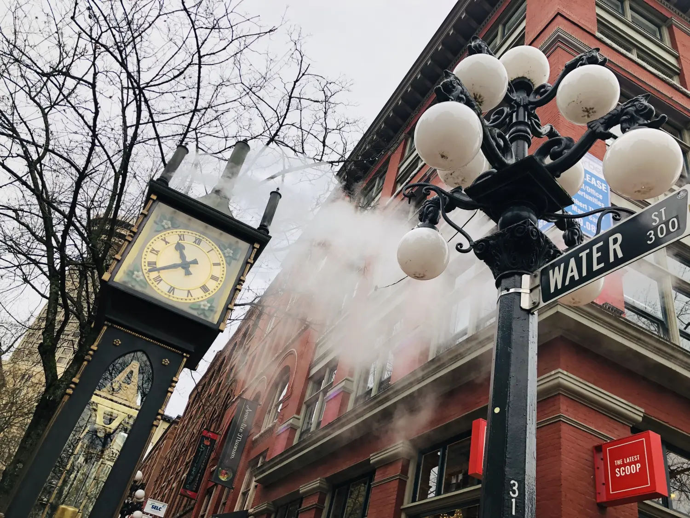

一年一见并不容易，花钱花力花时间。机票住宿免不了，吃喝又不能含糊，再加上各种不可预测的杂七杂八，这预算从半年前就被计划出来了，每月省点米面油菜的子儿（开玩笑，不至于这么抠）。但理智消费、节省开销是肯定的，竟有种夏天屯粮冬天好过冬的感觉，想奢侈一把的时候也不至于捉襟见肘。

一年一见值得期待，我现在才明白《小王子》里狐狸说：“如果你说你在下午四点来，从三点钟开始，我就开始感觉很快乐，时间越临近，我就越来越感到快乐。到了四点钟的时候，我就会坐立不安，我发现了幸福的价值，但是如果你随便什么时候来，我就不知道在什么时候准备好迎接你的心情了。”

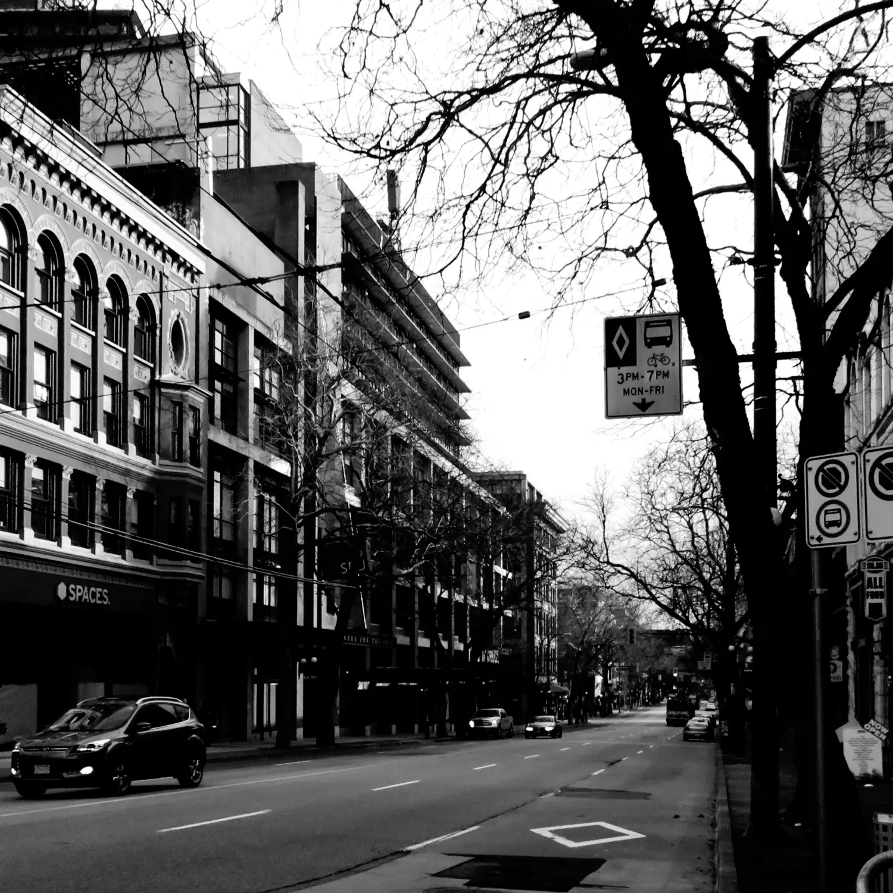

于是两张从东京和蒙特利尔飞往温哥华的机票早就订好了，收到提示航班临近的电子邮件都给我带来一阵喜悦。

## 最好梅酒配鱼生

“第一顿吃什么？” 关乎于吃，我向来严谨。温哥华作为移民大城拥有各国正宗而美味的食物，选择不是难事。

“去吃寿司和鱼生吧。”

“你不厌嘛？” 对一个刚从东京飞来还不到12小时的人，我产生质疑。

“温哥华的三文鱼刺身是太平洋的野生鲑鱼，听说比日本境内的好吃。”

于是我们找了一家日式餐厅，在圣诞节还营业的不多，所以这家显得非常热闹。

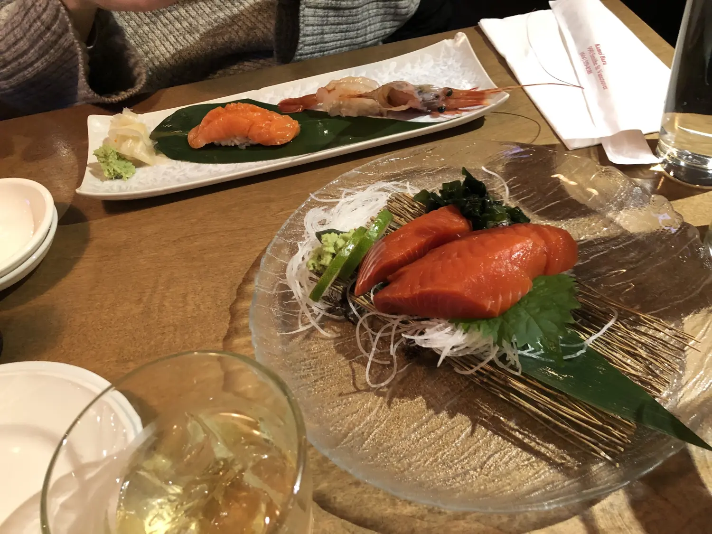

鱼生一上桌的那一刻我就知道这趟来对了，这么红的三文鱼还是第一次见。日本境内的高档刺身大多都是从金枪鱼身上切出来的，因为人们对蓝鳍金枪鱼的追捧远超其它鱼类。如此厚切的野生三文鱼也就成了难得一尝的美味。

鱼生配绿茶是寿司店通俗的做法，没毛病却不尽兴，而且我总幻觉吃下去的生鱼片在肚子里被热饮烫熟的场景，白花了这价钱。

鱼生配清酒是行内人的做法，解腻、杀菌、开胃，一石三鸟。但问题是越吃越多，有人曾告诉我技巧如何在自助餐厅吃掉最多的生鱼片？只要喝点清酒，可以再干掉一大盘鱼。可惜清酒不是我最喜欢的，我爱梅酒，两盎司梅酒三颗冰块，配鲑鱼刺身几片，手握寿司几只，不贪杯也不多吃，最好不过梅酒配鱼生。

## 最好山中泡温泉

距离温哥华两小时不到的车程之外有一个叫 Whistler 的滑雪小镇，位于群山之间，除去游客之外大概只有两百多个真正的居民。山里有一处叫 Scandinave Spa 的温泉，提供北欧疗法的温泉体验。

第一步先在热水池泡15分钟；第二步跳进冷水池5至10秒，我连两秒都没坚持的住，进去半身就跑出来了；第三步进桑拿蒸到浑身出汗；第四步裹好浴袍上躺椅休息。也许是太舒服的原因，我刚闭眼几分钟，身边就鼾声四起，有些老同志居然就那么睡过去了，声音不大，却此起彼伏，看来不止一人在大白天睡得香甜。

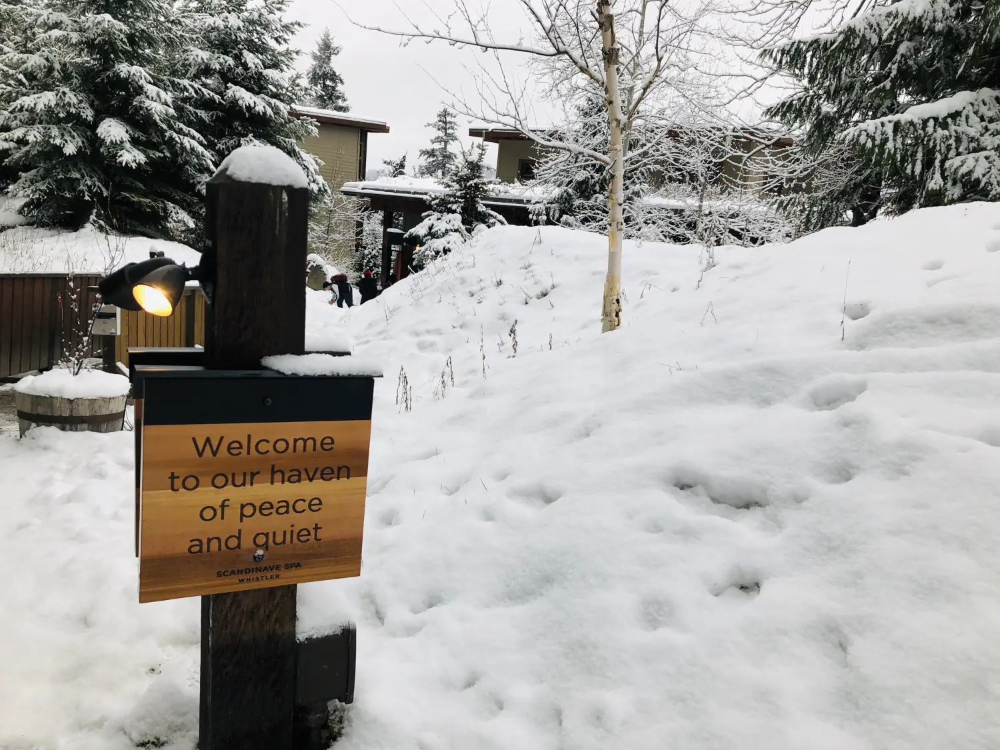

连鼾声也如此清晰是有原因的，因为整个温泉场内不让讲话。手机禁止，说话禁止，这么多人随意走动却听不见任何嘈杂。眼闭着，嘴也闭着，才发现心能离大自然这么近，我听见鸟鸣，听见风声，听见泉水，猛然间意识到安静的不像话，素质高也不是这么回事啊。

再一想我明白了，没有儿童，一个都没看见，原来19岁以下禁止进入。这才像话，没有小孩四处玩水的温泉简直舒服到上天，一池的成年人共同坚守着不言不语的游戏规则，四目相对，懒得讲话，连我都快躺睡着了。最好不过山中泡温泉。

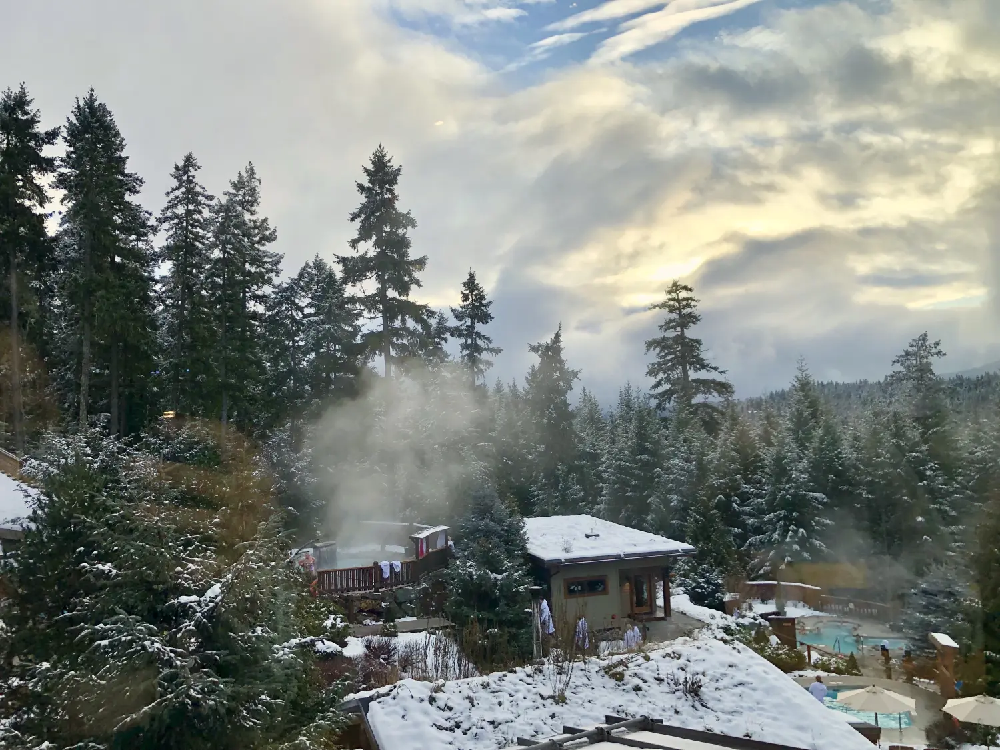

将以上步骤循环三到四次就达到疗效了。我没想到疗效惊人，把大姨妈都泡提前了，有福同享也罢有难同当也好，现在连生理期都被撞到了同一周，人生无处不凑巧。

## 最好路上谈电影

从温哥华去维多利亚需要坐轮渡，整段行程大概要四小时，先在温哥华市内坐轻轨转公交抵达港口一小时，坐船一个半小时，抵达维多利亚港口后再坐车进市内一小时。搭车坐船本身是件挺无聊的事，但总有些话题能恰如其分地在路上被“颠簸”出来，电影算是我们的一个共同爱好，而互换影单成了我们的习惯。

一年下来我们都各自看了大几十部电影，既关注新片，也重看经典，一问一答后发现几乎一半内容都是相同的。其实这种小事我们并没有事先沟通过，只是时间越久，却发现连挑影片的眼光都开始类似。

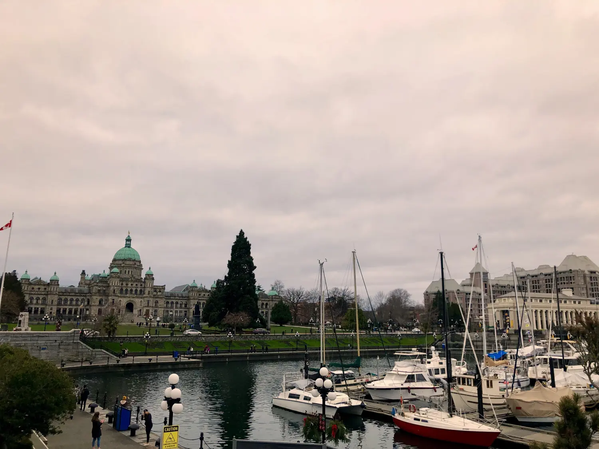

我依旧记得学生时代的我们一起看的第一部电影是意大利的《Best Offer》，那是某天晚饭后，她捧个笔记本电脑到我房间：“我有部好电影，看不看？”

“进来吧。” 我没问是什么电影，也顾不上写作业和查邮件，我们就一起坐在地毯上把电影一口气看完了。那是一部关于艺术品拍卖家和女骗子的故事，看一遍惊叹，看两遍深思，反复看反复想，那依然是我最喜欢的电影之一。

“这一部呢？《和莎莫的500天》，虽然时间挺久了…” 我逐条浏览自己的记录，然后随意抓了一个片名试探。

“看了大概都有五遍了，感觉我自己就像其中的莎莫。”

我下意识地制止了还在滚频的手指，脑海里开始迅速回忆整部电影。那真的是个浪漫而又现实的故事，我喜欢它，就因为它不是肤浅的大团圆，就因为它讲了个真实的道理：别成天做白日梦，生活总是经历失去后被迫成长，再绝地反击，如果你还有本事站起来的话。

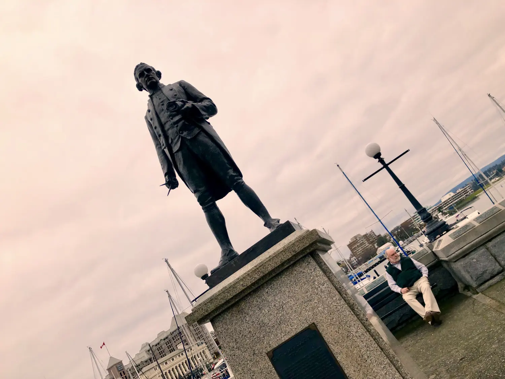

“好像还真是，挺像你。” 我已不用过多分析，浏览一个人的影单足迹可以看出很多无法掩盖的事实，比如性格，品味，思想，甚至心理。也许未必人人都喜欢莎莫那样的女孩，但我珍惜，就因为不完美带来的真实和可爱是那么的触手可及。生活中其实每个人身边都有这样的人物存在，美中不足，默契有余，在相互牵绊中彼此成长。这人有多好？缺点一大堆，但真实可靠，有时如镜子般反射我自身的不足。

一路颠簸，接下来一年该看的电影也列好清单了，就是那些你看了我没看的，和我看了你没看的。最好不过路上谈电影。

## 最好排队吃早餐

比温哥华更令我向往的是维多利亚，整座城市充满英国女王时代的遗风。雄伟高大的建筑如城堡如宫廷，令人赞叹，无名无姓的住宅更是精致到令我心动，就像彼得兔的家一样可爱。

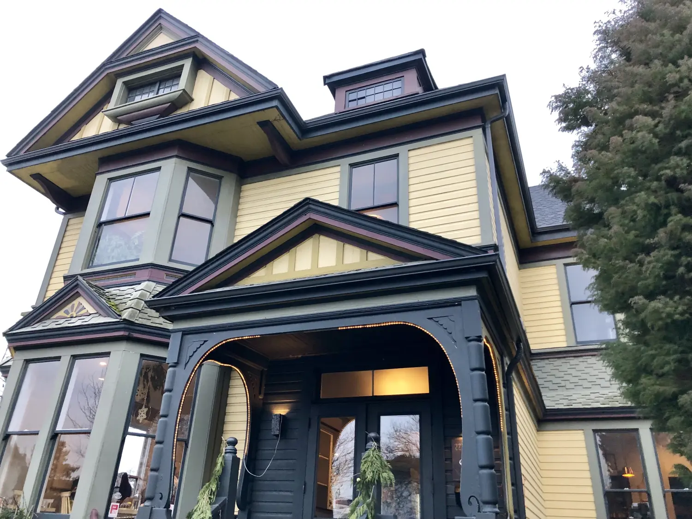

维多利亚这座城在食物方面认真地沿袭了英伦的吃相，比如鱼和炸薯条的无敌组合，再者就是松饼、华夫等甜食。

早餐该吃甜还是咸？这一直是个无法统一的答案，最好一人一道甜一道咸，各吃一半换盘子，这吃相丑的啊，但吃的满意倒是实话。

结果我们点了两道甜，一道松饼配树莓柠檬酱，一道厚吐司配草莓香蕉枫糖浆。实在是被当地特色吸引，两天早餐都是甜，两天早餐都排队，一天去的早，一天故意去的晚，还是没躲过排队的人潮。看来爱吃甜的人真的很多，也许甜松饼真的很好吃。

门外一群人排出一条长龙，估计要等半小时。还好维多利亚的冬天不算冷，能够得上排队吃饭的地方都是经得起群众考验的，我琢磨着，一回头才发现身后已经又聚拢了几簇人，我立刻靠拢，贴紧大部队。

“看，这上了个比你脸还大的松饼。” 是的，我的等待最终换来了卖相好、味道好，且实惠装的超大直径松饼。

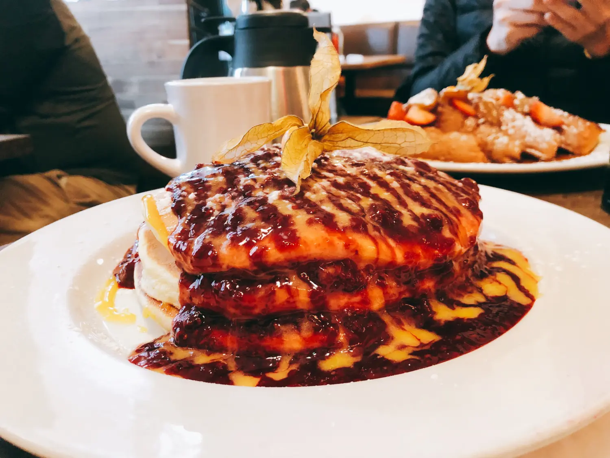

其实谁喜欢排队谁喜欢等呢？连排队上个厕所都心里不爽。每天恨不得一步登天，日子过起来不眨眼，结果什么也没留下什么也没记住，自问昨天午饭吃了什么？未必说得出。

虽不情愿，可我得承认，但凡经历等待的事情都难以忘怀。我记得排在我们前面的是四人组，结果小桌先空出来了，只有两人的我们十分荣幸地先进去了。

我记得大松饼堆起来有三张，厚吐司有四块。我记得装饰是一颗黄色的酸浆果，叶子还在。

我记得果汁两杯，一杯是橙汁，一杯西柚汁。我又要了一壶黑咖啡，在一堆甜味的衬托下，咖啡居然无比好喝。咖啡一壶三块五加币，无限续。

我记得我实在吃不下了，去了趟厕所，回头又多吃了两口减少浪费。

我甚至记得我左边一桌坐着四个男人，点了三种松饼和一个看不清里面装了什么的大碗。我记得右边一桌坐着两男两女，来的早走得快，后来拆成两小桌，新来的客人一胖一瘦，终于点了咸味的东西，于是我看到了鸡蛋卷和香肠。

我记得吃甜的桌上是枫糖浆一瓶，吃咸的客人就换成辣酱一瓶。

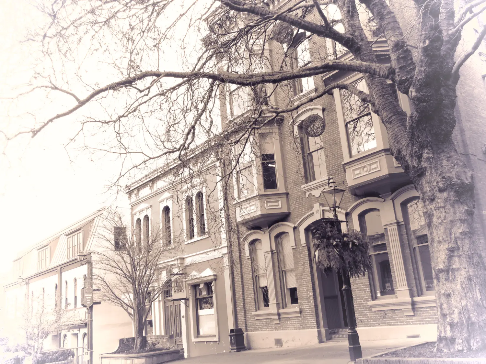

我越回忆越清晰，细节如侦探破案的蛛丝马迹一般浮出水面。我并非在意旁桌吃了什么，但等待本身仿佛能让时间的流动更加缓慢，除了吃，好像还有更多的东西进入了身体。

我记得，我怎么会忘记，那家好吃的店叫 Jam Cafe。最好不过排队吃早餐。

## 最好金龟换美酒

古有谪仙人（即李白）的一首《蜀道难》令贺知章大为赞赏，相见恨晚，遂成莫逆。对酒共饮处，贺知章没带酒钱，于是解下腰间金龟，作为酒钱。谪仙人大呼，皇家饰品怎可换酒？贺知章大笑，今日有幸与仙人喝酒，喝个痛快，区区金龟哪能妨碍？

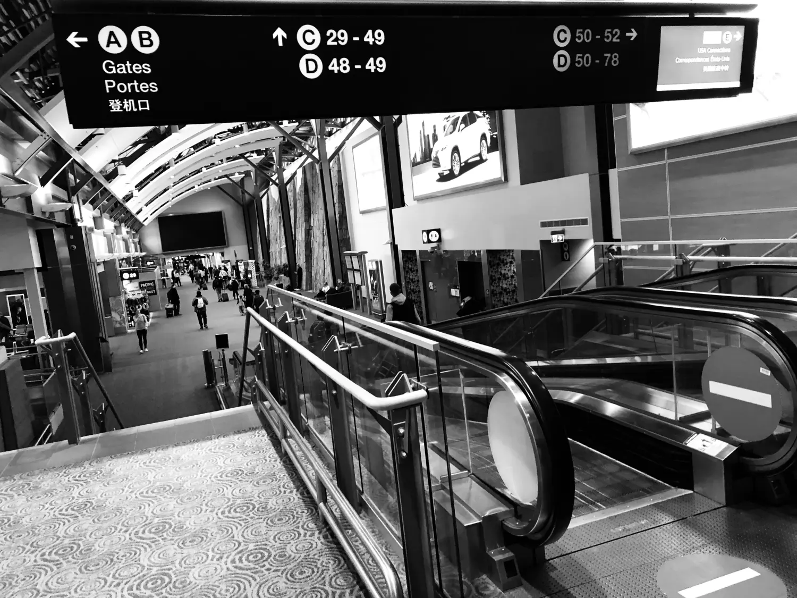

七天旅行，我们分别在2019年的最后一天，对明年的愿望呢？

“Get wiser." （长点儿脑吧，我说。）

"Get richer." （来点儿钱吧，你说。）

我不知明年又如何，千金龟，换美酒，值乎否？

努力一年，也就盼望几次任性；奋斗终身，终究只为几场巅峰。

而世间感情，最好不过，金龟换酒。