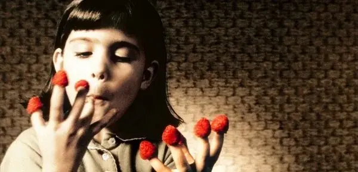
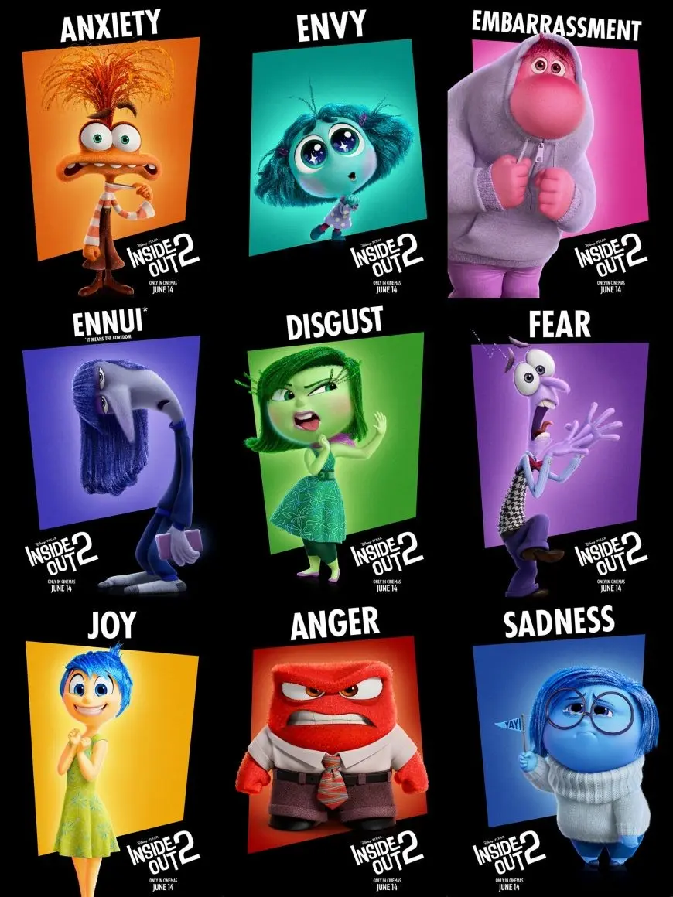

# 学会无聊 [ 2024-9-28 ]

九楼，是所有投行同事最爱来的地方，这里有我们自己的咖啡师，带一个杯子上来什么都可以点了喝。本来就是为了促进交流才有这个福利的，精英们在这里谈项目，聊strategy，和精英们混久了似乎觉得自己也是精英，可我总是把话题聊成了孩子。

周末去了哪里，干了什么，都是我们一家带两岁的女儿外出，去农场看猪马牛羊，去河边看鸭子，夏天摘蓝莓，前几周摘苹果，摘玉米，马上秋天又要去摘南瓜了。

开心的同时也很累，就是那种怎么周末比上班还累的感觉。带娃的女同事们也纷纷表示就是这样，这很正常。似乎不给孩子安排娱乐就不行。

眼前的这个法国父亲是我的一个新同事，他说在法国对孩子有这么一个要求：Il faut apprendre à s'ennuyer.

要让孩子学会无聊。

我们从小都被要求学会很多，要学知识，学礼貌，长大后要学技能，学工作。不开心时学乐观开朗，太开心时学沉着冷静。学表达，学收敛，学优雅，学做人。

但没有人说要学会无聊，就是学会在无事可做的状态下，接受那个状态，并愉快的度过那个时间。

我发现法国人是真的很懂无聊，那些经典电影一想也是这个道理。天使爱美丽里的无聊，刺猬的幽雅里的无聊，两小无猜也是。天使爱美丽是真的无聊，看着看着也觉得我自己很无聊，怎么他们的电影总是这样，想想放牛班的春天好像也有类似说不出的无聊。但这几部电影我都很喜欢，每一部里都有无聊的小孩。

开篇就是艾米莉的一串无聊行为，转手指，把脸挤在玻璃窗上做鬼脸，把樱桃挂在耳朵上当耳环，转硬币，吹树叶，吹纸片，把树莓套在十个手指上再一个个的吃过去。

他们的孩子就是这么长大的么？这不是玩的很开心很可爱么？没有东西玩不也是可以自己把自己玩的很开心么？他们的孩子就是这么从小学会无聊。

但别忘了天使爱美丽的法语片名本意是："艾米莉的奇异世界"，她在无聊里学会了创造一整个自己的世界啊。

这正是我这位法国同事的育儿理念，孩子在学会无聊的时候是想象力与创造力最强大的时候。不需要积木，拼图，智力玩具，早教班，很可能钱花了，时间花了，孩子还是不会玩，只是过早地学习了大人的游戏规则。

其实这不是我第一次听说法国人关于"学会无聊"的理论。我自己在休产假时看过一本育儿书叫Bring up bébé，讲的是作者自己，一个美国记者，在巴黎生了孩子并生活所经历的一系列美式育儿与法式育儿之间的惊讶与冲突。她发现自己总在孩子堆里忙里忙外，身边的各种法国妈妈常常自己坐那儿喝咖啡，孩子在旁边自己玩。你会觉得那个忙里忙外的妈妈付出更多么？不能这么表面地看问题，因为当你忙到停不下来才自问到底出了什么问题时就离崩溃不远了，法国妈妈是有自知之明的，确保自己没有被忽视，才会有更强大的内核去照顾一个更小的生命。

法国妈妈告诉美国妈妈，要让你的孩子学会无聊。读这个故事的我在等待自己的小生命，仿佛一个远远的观察者，并不知道会变成哪种妈妈。终于有一天再次和一个法国爸爸聊天时才发觉，原来你们真的是这么个育儿的手段啊，学会无聊这个痕迹才再次进入大脑。

除了s'ennuyer “无聊”这个动词，第二个常挂法国人嘴边的是 découvrir “发现”, 这个是我发现的。你不觉得无聊和发现的关系很微妙么？只有在无聊的时候才会发现啊？一个大脑已被填满行程也被填满的孩子，还有什么需要发现的呢？

华人圈的很多带娃行为多数受美式育儿影响，深度陪伴，过度重视，可要到多大才会明白原来这个世界并不是围着你这个小人转的？

法国家长的观念是 Delayed gratification: 延迟享乐。这是一个我们在成年后才提出的（依然多数人做不到的）要求，法国孩子却被从小灌输了。这一块饼干你现在不要吃，等我回来你再吃，那么我会再给你一块，如果你现在吃了就只有这一块。

有团队做过这个实验，把一群孩子分别关在不同的空房间里，只给一块饼干，并说只要不吃就能最后得到两块，时间大概二十分钟。孩子们的表现千姿百态，不明白或不在乎的立刻就吃了，当下很开心，接下来的二十分钟在空房间里歇斯底里。明白道理的孩子一直盯着饼干看，告诉自己不要吃，扭头不看，又抓抓饼干，再放下，但终究还是抵制不住诱惑，把饼干吃了。法国孩子似乎从头到尾就没看到那个饼干，在空空的房间里蹦来蹦去，吹空气，唱歌，手舞足蹈，在无聊，二十分钟很快就过去了，得到两块饼干。

区别在哪里呢？要做到延迟享乐就要先抵制诱惑，这连成人都做不到，又怎么可能指望孩子做到？但抵制诱惑的关键从来不是抵制或意志力，而是分散注意力。越是抵制，越是盯着那个饼干看，越是无法抵制。但分散注意力，却是简单到连孩子都可以做到。

学会无聊的孩子自己学会了耐心等待，原来欲望不需要立刻满足，原来一切不是伸手就来。

我的邻居是很典型的美式育儿，妈妈决定在家全职育儿五年，不去日托，一切自己托，提前三年拜访学校为了找到心仪的幼儿园，并已经加入等待名单。当时听得我心脏都快爆炸了，我家才一岁半，她家比我家还小六个月呢！她已经想好了去私校，不去公立，哪里哪里，这路铺的一望无际。

相比之下我什么都没计划，我把这一团焦虑统统转达给家属，他说没事的，孩子会长大。我常常需要他把我那些初露苗头的焦虑掐灭，It's ok. It's ok.

我问那法国父亲，你会计划你孩子以后干什么选什么职业么？不在计划内。你孩子要是想做面包呢？那就做面包去吧。

我常想“法式”到底是有什么je ne sais quoi魅力在那里，法式慵懒，法式浪漫，松弛感大概也分三六九等，法式松弛感，你从没听过美式松弛，他们永远也松弛不了。这一切的源头是不是都来自于法式无聊？是不是学会无聊以后，哪天我就自带松弛感了。

美国人也知道法国人骨子里那套无聊。最近看完Insideout2 （头脑特工队）第二部里新加了几个心情卡通人物。第一部里那五个经典的心情是：开心Joy，悲伤Sadness，惧怕Fear，生气Anger ，厌恶Disgust ，第二部新加的是：焦虑Anxiety ，嫉妒Envy，尴尬Embarrassment ，还有无聊Ennui 。注意到了没，所以人物的名字就是他所对应的那个心情的英语单词，唯独无聊Ennui，是个法语单词。他的人物造型也是个丧丧的法国脸，无聊到不说话，一开口就是oh lala, pardon excusez-moi，唯一一个在英语动画里讲法语的形象，因为他是无聊。

